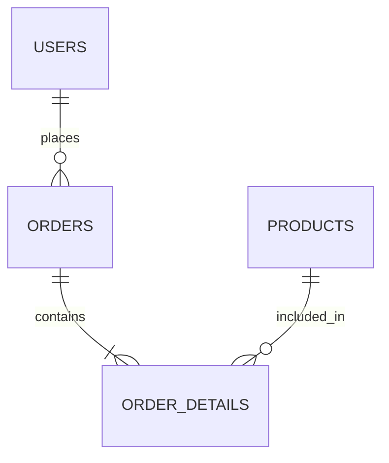

# データ設計共通

## 0. ドキュメント情報
| 項目 | 内容 |
| -- | -- |
| システム名 | [System Name] |
| 対象範囲 | データベース設計 |
| バージョン | 1.0 |
| 作成日 | YYYY-MM-DD |
| 作成者 | [Name] |
| 承認者 | [Name] |

## 1. データモデル設計方針
### 1.1 基本方針
- **正規化**: 第3正規形（3NF）を基本とする
- **DBMS**: PostgreSQL / MySQL / Aurora
- **文字コード**: UTF-8 (utf8mb4)

### 1.2 命名規約
- **テーブル名**: 英小文字 snake_case 複数形 (例: `users`, `order_details`)
- **カラム名**: 英小文字 snake_case (例: `user_id`, `created_at`)
- **主キー**: `id` (基本的) または `[table_name]_id`
- **外部キー**: `[target_table]_id`

### 1.3 共通カラム定義
すべてのテーブル（または主要テーブル）に付与するカラム。

| カラム名 | 論理名 | 型 | 制約 | 説明 |
| -- | -- | -- | -- | -- |
| created_at | 作成日時 | DATETIME / TIMESTAMPTZ | NOT NULL | レコード作成日時 |
| updated_at | 更新日時 | DATETIME / TIMESTAMPTZ | NOT NULL | レコード最終更新日時 |
| deleted_at | 削除日時 | DATETIME / TIMESTAMPTZ | NULLABLE | 論理削除用フラグ |
| version | バージョン | INT | DEFAULT 1 | 楽観ロック用 |

### 1.4 削除方針
- **論理削除**: 主要なトランザクションデータ、マスタデータ (`deleted_at` is not null)
- **物理削除**: ログデータ、一時データ、機密情報が含まれるデータ

## 2. ER図
<!-- mermaid記法または画像リンク -->

## 改訂履歴
| バージョン | 日付 | 変更内容 | 承認者 |
| -- | -- | -- | -- |
| 1.0 | 2026-XX-XX | 初版作成 | - |
