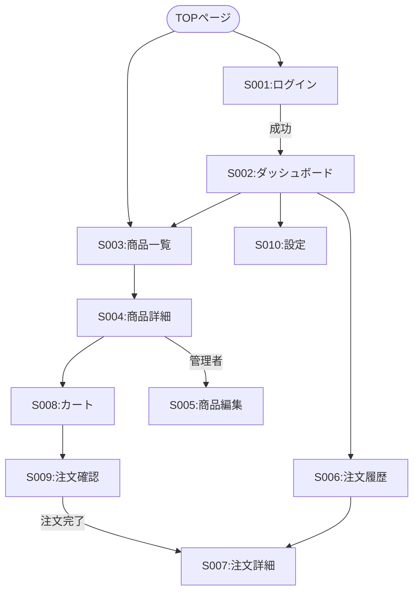

# 画面設計共通

## 0. ドキュメント情報
| 項目 | 内容 |
| -- | -- |
| システム名 | [System Name] |
| 対象範囲 | 全画面共通仕様 |
| バージョン | 1.0 |
| 作成日 | YYYY-MM-DD |
| 作成者 | [Name] |
| 承認者 | [Name] |

## 1. 画面一覧
| 画面ID | 画面名称 | 概要 | 権限 | URLパス | 備考 |
| -- | -- | -- | -- | -- | -- |
| S001 | ログイン画面 | ユーザー認証を行う | 全員 | `/login` | |
| S002 | ダッシュボード | 概要情報を表示する | ログインユーザー | `/dashboard` | |
| S003 | 商品一覧画面 | 商品の一覧を表示 | 全員 | `/products` | |
| S004 | 商品詳細画面 | 商品の詳細情報を表示 | 全員 | `/products/:id` | |
| S005 | 商品編集画面 | 商品情報を編集 | 管理者 | `/products/:id/edit` | |
| S006 | 注文履歴画面 | ユーザーの注文履歴を表示 | ログインユーザー | `/orders` | |
| S007 | 注文詳細画面 | 注文の詳細情報を表示 | ログインユーザー | `/orders/:id` | |
| S008 | カート画面 | 購入する商品を管理 | 全員 | `/cart` | |
| S009 | 注文確認画面 | 注文内容を確認 | ログインユーザー | `/checkout` | |
| S010 | ユーザー設定画面 | プロフィール情報を編集 | ログインユーザー | `/settings` | |

### 1.1 権限マトリクス
| 画面ID | 画面名称 | ゲスト | 一般ユーザー | 管理者 | 備考 |
| -- | -- | -- | -- | -- | -- |
| S001 | ログイン画面 | ✓ | ✓ | ✓ | ログイン済みはリダイレクト |
| S002 | ダッシュボード | ✕ | ✓ | ✓ | |
| S003 | 商品一覧画面 | ✓ | ✓ | ✓ | |
| S004 | 商品詳細画面 | ✓ | ✓ | ✓ | |
| S005 | 商品編集画面 | ✕ | ✕ | ✓ | 403 Forbidden表示 |
| S006 | 注文履歴画面 | ✕ | ✓ | ✓ | 自分の注文のみ表示 |
| S007 | 注文詳細画面 | ✕ | ✓ | ✓ | 自分の注文のみ表示 |
| S008 | カート画面 | ✓ | ✓ | ✓ | ゲストカート対応 |
| S009 | 注文確認画面 | ✕ | ✓ | ✓ | ログイン必須 |
| S010 | ユーザー設定画面 | ✕ | ✓ | ✓ | |

## 2. 画面遷移図

## 3. 共通仕様
### 3.1 ヘッダー・フッター
**ヘッダー構成**:
- ロゴ（左上、クリックでTOPへ）
- グローバルナビゲーション：商品一覧、カート、マイページ
- 検索ボックス（中央）
- ユーザーメニュー（右上）：プロフィール、設定、ログアウト
- カートアイコン（バッジ：商品数表示）

**フッター構成**:
- 企業情報リンク
- 利用規約、プライバシーポリシー
- SNSリンク
- 著作権表示

### 3.2 共通エラーメッセージ
#### 3.2.1 エラー表示方式
- **トースト通知**: 画面右上から3秒間表示（自動消去）
- **インラインアラート**: フォーム直上に表示（手動で閉じる）
- **フィールドエラー**: 入力欄下に赤文字で表示

#### 3.2.2 エラーメッセージ一覧
| エラーコード | メッセージ | 表示方式 | 発生タイミング |
| -- | -- | -- | -- |
| E001 | 入力内容に誤りがあります | インライン | バリデーションエラー |
| E002 | ログインに失敗しました。メールアドレスまたはパスワードが正しくありません | トースト | 認証失敗 |
| E003 | セッションが期限切れです。再度ログインしてください | トースト | セッションタイムアウト |
| E004 | この操作を実行する権限がありません | インライン | 認可エラー |
| E005 | データが見つかりませんでした | インライン | 404 Not Found |
| E006 | 一時的なエラーが発生しました。しばらくしてから再度お試しください | トースト | サーバーエラー |
| E007 | ネットワークエラーが発生しました。接続を確認してください | トースト | ネットワーク障害 |
| E008 | 在庫が不足しています | インライン | 在庫不足 |

### 3.3 ページネーション・ソート・フィルタ
**ページネーション**:
- デフォルト: 20件/ページ
- 表示件数変更: 10/20/50/100件
- ページャー位置: 一覧下部および上部
- 無限スクロールは不採用（SEO対策）

**ソート**:
- デフォルト: 作成日時降順
- カラムヘッダークリックでソート切り替え
- 矢印アイコンで昇順・降順表示

**フィルタ**:
- 検索ボックス: リアルタイム検索（300msのデバウンス）
- 適用中フィルターをバッジ表示（削除可能）

### 3.4 アクセシビリティ・レスポンシブ方針
- **アクセシビリティ**: WCAG 2.1 AA準拠（コントラスト比4.5:1以上）
- **レスポンシブ**: PC (>1024px) / Tablet / Mobile (<768px)

### 3.5 インタラクション状態 (States)
- **Default**: 初期表示
- **Loading**: データ取得中（スケルトン推奨）
- **Empty**: データ0件の表示とアクション
- **Error**: エラー時のトースト/インライン

### 3.6 セキュリティ対策
- **入力値のサニタイズ**: DOMPurify + サーバー再バリデーション
- **XSS対策**: CSP、`dangerouslySetInnerHTML`禁止
- **CSRF対策**: SameSite Cookie + トークン検証
- **クリックジャッキング対策**: X-Frame-Options: DENY

### 3.7 キーボードショートカット
| キー操作 | 機能 | 対象画面 |
| -- | -- | -- |
| `/` | 検索ボックスにフォーカス | 全画面 |
| `Esc` | モーダル/ドロワーを閉じる | 全画面 |
| `Ctrl + K` | コマンドパレット表示 | 全画面 |
| `Tab` | 次の要素にフォーカス | 全画面 |
| `Shift + Tab` | 前の要素にフォーカス | 全画面 |
| `Enter` | フォーム送信 / ボタン実行 | 入力フォーム |
| `← →` | ページネーション | 一覧画面 |

### 3.8 多言語対応 (i18n)
- 初期フェーズ: 日本語のみ
- 将来対応: 英語、中国語（簡体）
- ライブラリ: `react-i18next`

### 3.9 パフォーマンス指標
| 指標 | 目標 | 計測方法 |
| -- | -- | -- |
| FCP | 1.5秒以内 | Lighthouse |
| LCP | 2.5秒以内 | Lighthouse |
| TTI | 3.5秒以内 | Lighthouse |
| CLS | 0.1以下 | Lighthouse |
| TBT | 300ms以下 | Lighthouse |

### 3.10 デザインシステム
- **コンポーネントライブラリ**: Material-UI (MUI) v5
- **フォント**: Noto Sans JP
- **スペーシング**: 8pxベース
- **Storybook**でコンポーネント管理

## 改訂履歴
| バージョン | 日付 | 変更内容 | 承認者 |
| -- | -- | -- | -- |
| 1.0 | 2026-01-08 | 初版作成 | - |
