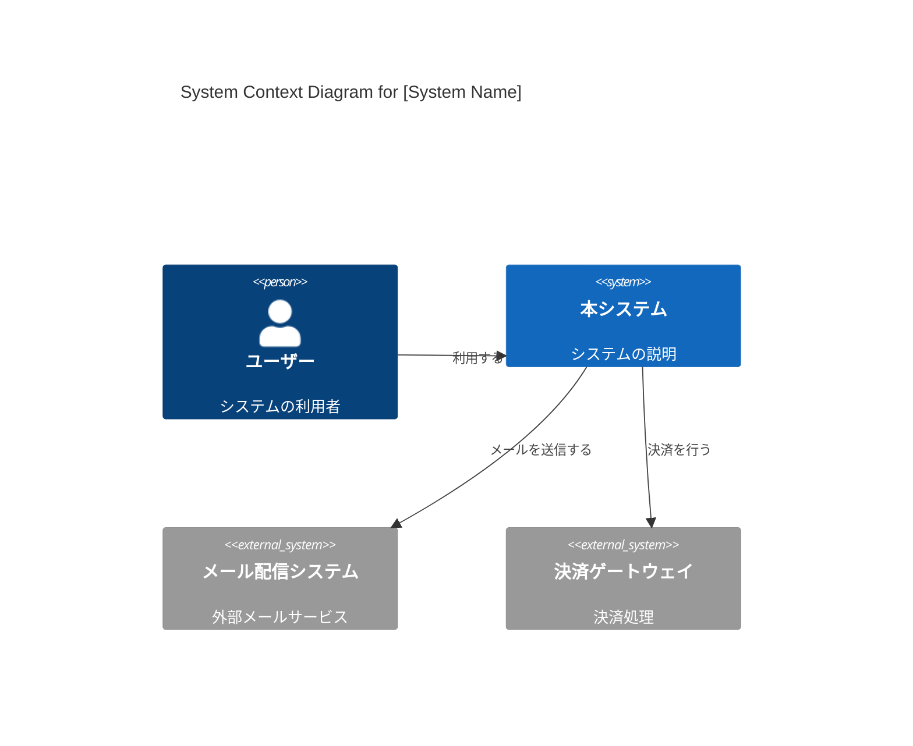
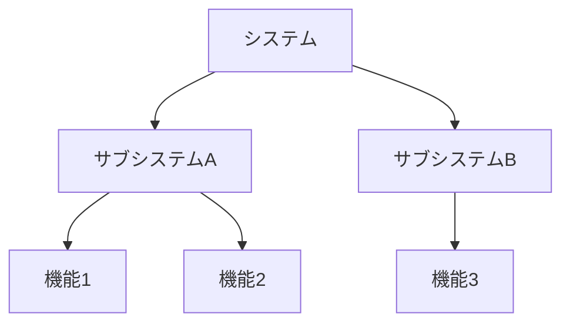

# 基本設計書

## 1. はじめに
### 1.1 ドキュメントの目的
<!-- 本ドキュメントの目的を記述します。どのような決定事項を共有するためのものか明確にします。 -->

### 1.2 対象読者
<!-- 本ドキュメントの想定読者を記述します（例：プロジェクトマネージャー、開発者、運用担当者、顧客など）。 -->

### 1.3 関連ドキュメント
<!-- 本設計書の前提となるドキュメントや、関連する詳細設計書へのリンクを記述します。 -->
* [要件定義書](../要件定義書.md)
* [方式設計書](./方式設計書.md)

## 2. システム概要 (C4 Model - Level 1: System Context)
### 2.1 システムの背景と目的
<!-- システム開発に至った背景、解決すべき課題、達成すべきビジネスゴールを記述します。 -->

### 2.2 システムコンテキスト図
<!-- システムと、それを取り巻くユーザーや外部システムとの関係を示します。 -->

### 2.3 システムの範囲（スコープ）
<!-- 本システムで開発する機能の範囲、およびシステム外とする範囲を明確にします。 -->

## 3. アーキテクチャ上の決定事項 (ADR: Architecture Decision Records)
<!-- 重要なアーキテクチャ上の意思決定を記録します。 -->
| ID | タイトル | ステータス | 決定事項 | コンテキスト・理由 |
| -- | -- | -- | -- | -- |
| ADR-001 | マイクロサービスの採用 | 採用 | サービスを機能単位で分割する | スケーラビリティと独立したデプロイのため |
| ADR-002 | PostgreSQLの採用 | 採用 | RDBMSとしてPostgreSQLを使用 | チームの習熟度とJSONBサポートのため |

## 4. 機能要件概要
<!-- 要件定義書に基づいて、実装する主な機能をカテゴライズして記述します。詳細な機能一覧へのリンクでも可。 -->
### 3.1 機能構成図

### 3.2 主要機能一覧
| ID | 機能名 | 概要 | 備考 |
| -- | -- | -- | -- |
| F001 | ログイン機能 | ユーザー認証を行う | |
| F002 | データ登録 | データを新規登録する | |

## 4. 非機能要件概要
<!-- 可用性、性能、セキュリティ、運用・保守性などの非機能要件の方針を記述します。詳細な数値目標は要件定義書や方式設計書に譲り、ここでは設計への反映方針を示します。 -->
### 4.1 可用性・信頼性
<!-- 例：24時間365日稼働、冗長化構成など -->
### 4.2 性能・拡張性
<!-- 例：同時接続数1000、将来的なスケールアウト方針など -->
### 4.3 セキュリティ
<!-- 例：通信の暗号化、個人情報の保護方針など -->

## 5. 外部インターフェース概要
<!-- 他システムとの連携がある場合、その概要を記述します。詳細は外部インターフェース設計書に記述します。 -->
| 連携先システム | 連携方式 | データフロー | 備考 |
| -- | -- | -- | -- |
| 基幹システム | REST API | 本システム -> 基幹システム | |

## 6. 運用・保守の基本方針
<!-- システム稼働後の運用体制、監視レベル、バックアップ方針などの概要を記述します。 -->

## 7. 今後の拡張性・制約事項
<!-- 将来的な機能追加の予定や、現時点での技術的・予算的な制約事項を記述します。 -->
