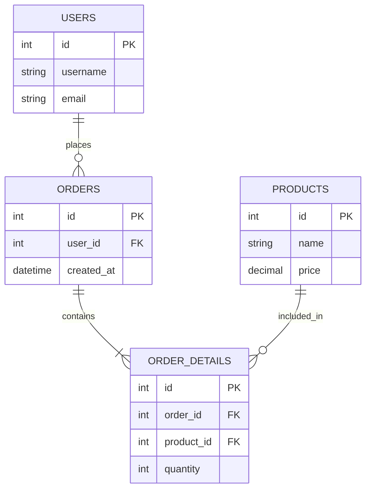

# データ設計書

## 1. データモデル概要
### 1.1 ER図 (Entity Relationship Diagram)
<!-- システム全体のER図をMermaidなどで記述します。 -->

## 2. テーブル定義書
<!-- 各テーブルの詳細定義を記述します。 -->

### 2.1 USERS (ユーザーマスタ)
**論理名**: ユーザーマスタ
**物理名**: `users`
**概要**: システムを利用するユーザー情報を管理する。

| No | 論理名 | 物理名 | 型 | 桁数 | PK | FK | NotNull | Default | 備考 |
| -- | -- | -- | -- | -- | -- | -- | -- | -- | -- |
| 1 | ユーザーID | id | INT | | 〇 | | 〇 | AUTO_INC | |
| 2 | ユーザー名 | username | VARCHAR | 255 | | | 〇 | | |
| 3 | メールアドレス | email | VARCHAR | 255 | | | 〇 | | Unique |
| 4 | 作成日時 | created_at | DATETIME | | | | 〇 | NOW() | |
| 5 | 更新日時 | updated_at | DATETIME | | | | 〇 | NOW() | |

### 2.2 ORDERS (注文テーブル)
<!-- 以下同様に記述 -->

## 3. データボリューム見積もり
| テーブル名 | 初期レコード数 | 月間増加数 | 年間増加数 | 3年後想定レコード数 | 備考 |
| -- | -- | -- | -- | -- | -- |
| users | 1,000 | 100 | 1,200 | 4,600 | |
| orders | 0 | 5,000 | 60,000 | 180,000 | |

## 4. バックアップ・ライフサイクルポリシー
### 4.1 バックアップ運用
* **バックアップ**: 日次フルバックアップ（AM 3:00）、WALアーカイブログによるPITR対応
* **保存期間**: 
    - トランザクションデータ: 7年
    - ログデータ: 1年

### 4.2 データライフサイクルと削除
<!-- データの発生から廃棄までの流れを定義します。 -->
| データ種別 | 保存期間 | 削除タイミング | 削除方式 |
| -- | -- | -- | -- |
| 退会ユーザーデータ | 30日後 | 日次バッチ | 物理削除 |
| アクセスログ | 1年 | 月次ローテーション | アーカイブ後削除 |

### 4.3 プライバシー・コンプライアンス（個人情報保護）
<!-- GDPR/APPIなどの法規制への対応方針。 -->
* 特定個人情報（マイナンバー等）の扱い: 本システムでは保持しない / 暗号化して保持する。
* データの匿名化・仮名化の方針: 分析用データエクスポート時に個人特定要素をハッシュ化する。
