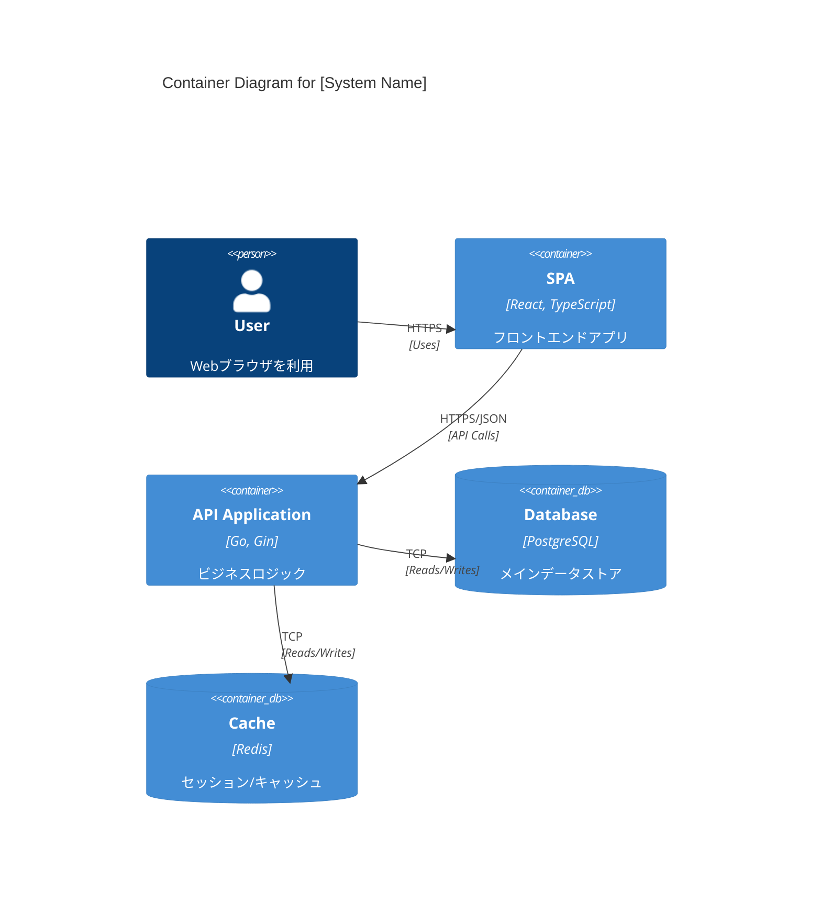
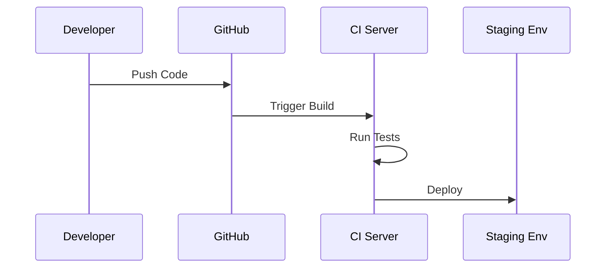

# 方式設計書

## 1. アーキテクチャ概要
<!-- システム全体のアーキテクチャ方針（モノリス、マイクロサービスなど）とその採用理由を記述します。 -->

## 2. 技術スタック
### 2.1 クライアントサイド
| カテゴリ | 技術・ツール | バージョン | 選定理由 |
| -- | -- | -- | -- |
| 言語 | TypeScript | 5.x | 型安全性確保のため |
| フレームワーク | React | 18.x | 開発効率とパフォーマンス |

### 2.2 サーバーサイド
| カテゴリ | 技術・ツール | バージョン | 選定理由 |
| -- | -- | -- | -- |
| 言語 | Go | 1.21 | 高速な実行速度 |
| フレームワーク | Gin | 1.9 | 軽量・高速 |

### 2.3 データベース・ストレージ
| カテゴリ | 技術・ツール | バージョン | 選定理由 |
| -- | -- | -- | -- |
| RDBMS | PostgreSQL | 15.x | 信頼性と機能性 |
| Cache | Redis | 7.x | セッション管理高速化 |

### 2.4 インフラ・環境
| カテゴリ | サービス・ツール | 用途 |
| -- | -- | -- |
| Cloud Provider | AWS | インフラ基盤 |
| Container | Docker | 開発・実行環境の統一 |

## 3. システム構成図 (C4 Model - Level 2: Container)
### 3.1 コンテナ図 (Container Diagram)
<!-- アプリケーションの実行単位（コンテナ）と、データストアの関係を示します。 -->

### 3.2 ソフトウェア構成図
<!-- 各サーバー内で動作するプロセスやミドルウェアの関係を示します。 -->

## 4. Documentation as Code
<!-- 設計書やインフラ構成（IaC）をコードとして管理する方針 -->
* **管理方法**: すべての設計書はMarkdownで記述し、Gitリポジトリ（`docs/`ディレクトリ）で管理する。
* **図の描画**: Mermaid.jsを使用し、修正が容易な状態を維持する。
* **更新フロー**: コードへの変更Pull Requestには、対応するドキュメントの更新も含めること。

## 5. 非機能要件の実装方式
### 5.1 可用性設計
<!-- 冗長化（Active-Active/Active-Standby）、フェイルオーバーの仕組みを記述します。 -->
* Webサーバー: ロードバランサーによる負荷分散（Multi-AZ）
* DBサーバー: マスタ・スレーブ構成

### 4.2 性能・拡張性設計
<!-- スケールアップ・スケールアウトの方針、キャッシュ戦略、CDN利用などを記述します。 -->

### 4.3 セキュリティ設計
<!-- 具体的なセキュリティ実装方式を記述します。 -->
* 通信の暗号化（SSL/TLS）
* 認証方式（OAuth2.0 / JWTなど）
* データの暗号化（保管時）
* WAFの導入

### 4.4 ログ・監視設計
<!-- ログの出力先、フォーマット、監視項目、通知設定について記述します。 -->
* アプリケーションログ: JSON形式で標準出力 -> CloudWatch Logs
* 監視ツール: Datadog / CloudWatch Alarms

### 4.5 バックアップ・リカバリ設計
<!-- バックアップの頻度、保持期間、リストア手順の概要を記述します。 -->

## 5. 開発・運用環境
### 5.1 環境区分
| 環境名 | 用途 | 構成概要 | アクセス制限 |
| -- | -- | -- | -- |
| Development (Dev) | 開発者による機能実装・単体テスト | ローカル / 開発サーバー | 開発者のみ |
| Staging (Stg) | 本番相当環境での結合テスト・受入テスト | 本番と同等（縮小構成） | 社内限定 |
| Production (Prod) | 実運用 | フル構成 | 制限あり |

### 5.2 CI/CDパイプライン
<!-- ビルド、テスト、デプロイの自動化フローを記述します。 -->
* ソースコード管理: GitHub
* CI/CDツール: GitHub Actions

## 6. エラーハンドリング方針
<!-- システム全体でのエラー検知、ログ出力、ユーザーへの応答の共通ルールを定義します。 -->

## 7. 制約事項・前提条件
<!-- 技術的な制約や、特定の環境・バージョンに依存する事項があれば記述します。 -->
