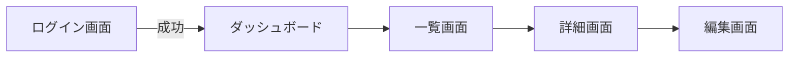

# 画面設計書

## 1. 画面一覧
| 画面ID | 画面名称 | 概要 | 権限 | 備考 |
| -- | -- | -- | -- | -- |
| S001 | ログイン画面 | ユーザー認証を行う | 全員 | |
| S002 | ダッシュボード | 概要情報を表示する | ログインユーザー | |

## 2. 画面遷移図
<!-- 画面間の遷移フローを記述します。 -->

## 3. 共通仕様
### 3.1 ヘッダー・フッター
<!-- 全画面共通のヘッダー・フッターのデザインや機能を記述します。 -->
### 3.2 共通エラーメッセージ
<!-- エラー発生時の共通的な表示などの仕様を記述します。 -->
### 3.3 ページネーション・ソート・フィルタ
<!-- 一覧画面における共通の挙動を定義します。 -->

### 3.4 アクセシビリティ・レスポンシブ方針
<!-- WCAG 2.1 Level AA準拠などの目標や、デバイスごとの表示方針について記述します。 -->
* **アクセシビリティ**: コントラスト比 4.5:1以上確保、スクリーンリーダー対応（適切なaria-label）。
* **レスポンシブ**: PC (Breakpoints > 1024px) / Tablet / Mobile (Breakpoints < 768px) 対応。

### 3.5 インタラクション状態 (States)
<!-- UIの各状態における表示ルールを定義します。 -->
* **Default**: 初期表示状態。
* **Loading**: データ取得中の読み込み表示（スケルトンスクリーン推奨）。
* **Empty**: データが0件の場合の「データがありません」表示とアクション（登録ボタン等）。
* **Error**: エラー発生時のトースト通知またはインラインアラート表示。

## 4. 画面詳細定義
<!-- 画面ごとに章を設けて詳細を記述します。 -->

### 4.1 [S001] ログイン画面
#### 4.1.1 画面レイアウト概要
<!-- ワイヤーフレームの画像貼付、またはテキストでのレイアウト説明。 -->
* ロゴ画像（中央上）
* ユーザーID入力欄
* パスワード入力欄
* ログインボタン
* パスワード忘れリンク

#### 4.1.2 画面項目定義
| No | 項目名 | 形式 | 必須 | 初期値 | 入力規則・バリデーション | 備考 |
| -- | -- | -- | -- | -- | -- | -- |
| 1 | ユーザーID | Text | 〇 | なし | アルファベット小文字、数字、記号 | |
| 2 | パスワード | Password | 〇 | なし | 8文字以上 | |
| 3 | ログイン | Button | - | - | クリックで認証処理を実行 | |

#### 4.1.3 イベント・アクション定義
| イベント | トリガー | 処理概要 | 遷移先 |
| -- | -- | -- | -- |
| ログインボタン押下 | Click | `POST /api/login` を呼び出す。 成功時: トークン保存して遷移。 失敗時: エラーメッセージ表示。 | 成功: ダッシュボード 失敗: 自画面 |

---
### 4.2 [S002] ダッシュボード
<!-- 以下同様に記述 -->
