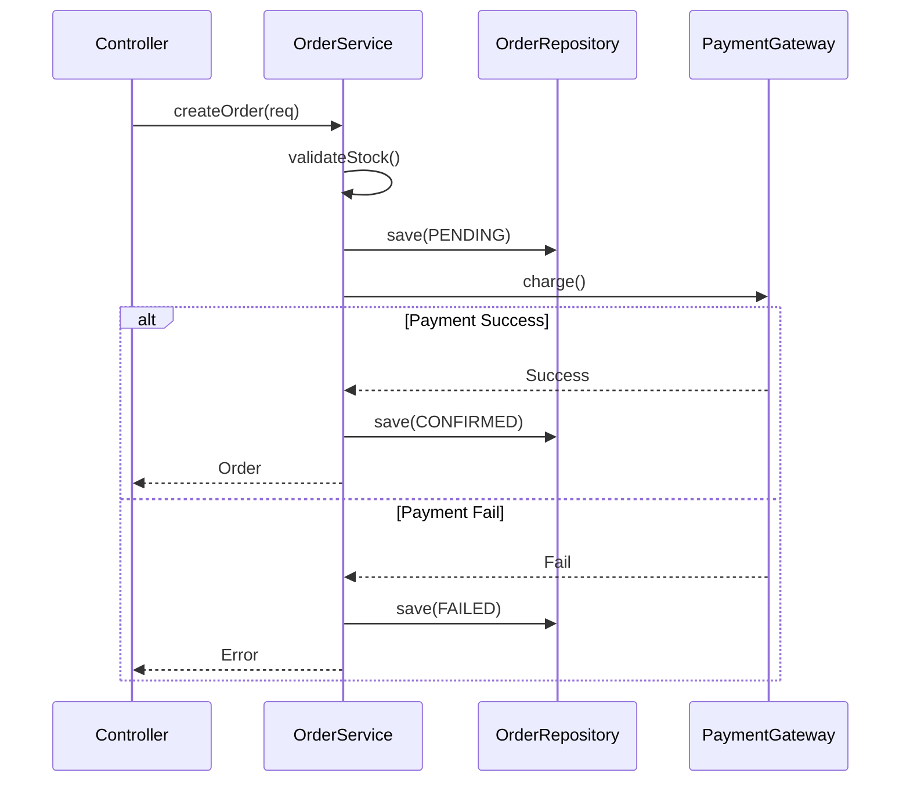

# 詳細設計書

## 1. モジュール一覧
| モジュールID | 名称 | 概要 | 担当 |
| -- | -- | -- | -- |
| M001 | OrderService | 注文処理ロジック | サーバー |
| M002 | PaymentGateway | 決済連携アダプタ | サーバー |

## 2. 詳細設計詳細

### 2.1 [M001] OrderService
#### 2.1.1 クラス設計
**Class**: `OrderService`
**Package**: `com.example.service`

**Methods**
| 修飾子 | 返り値 | メソッド名 | 引数 | 概要 |
| -- | -- | -- | -- | -- |
| public | Order | createOrder | OrderRequest req | 注文を作成する |
| private | void | validateStock | int productId | 在庫チェック |

#### 2.1.2 処理ロジック (createOrder)
1. **入力バリデーション**:
   - `OrderRequest`の必須項目チェック。
   - 不正な場合は`InvalidRequestException`をスロー。
2. **在庫確保**:
   - `InventoryService`を呼び出し在庫を引き当てる。
   - 在庫不足時は`OutOfStockException`をスロー。
3. **注文データ保存**:
   - `OrderRepository`を使用してDBにステータス「PENDING」で保存。
4. **決済処理**:
   - `PaymentGateway`を呼び出す。
   - 失敗時はDBのステータスを「FAILED」に更新して終了。
5. **完了メール送信**:
   - 非同期でメール送信処理をキューイング。
6. **戻り値**: 作成された`Order`オブジェクトを返す。

#### 2.1.3 シーケンス図

