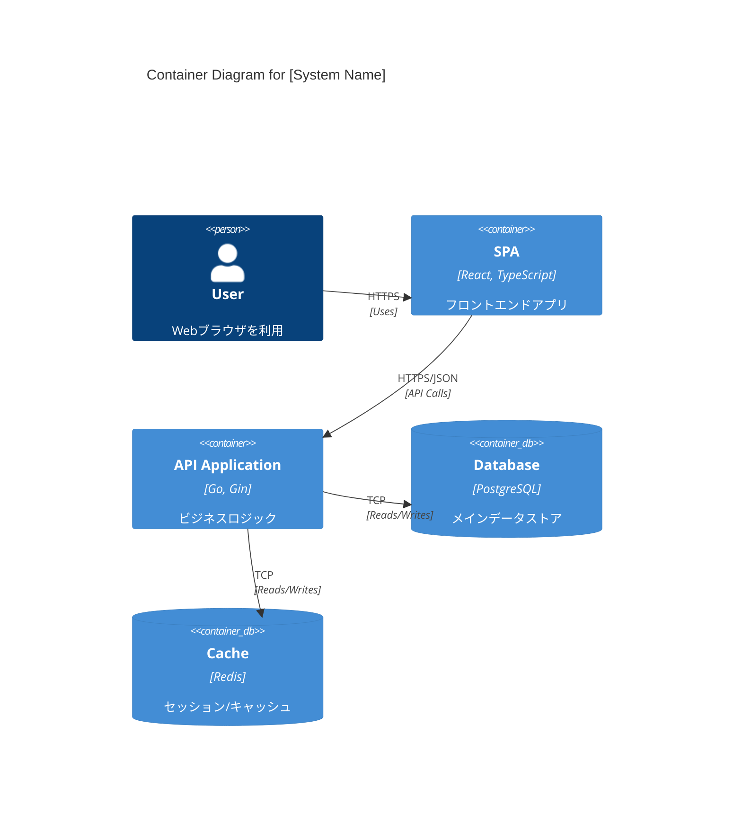
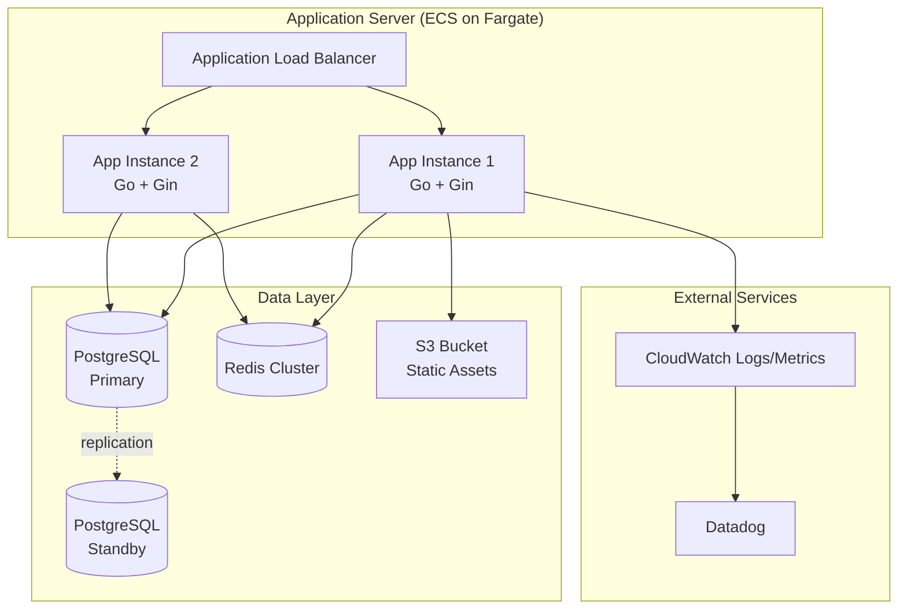
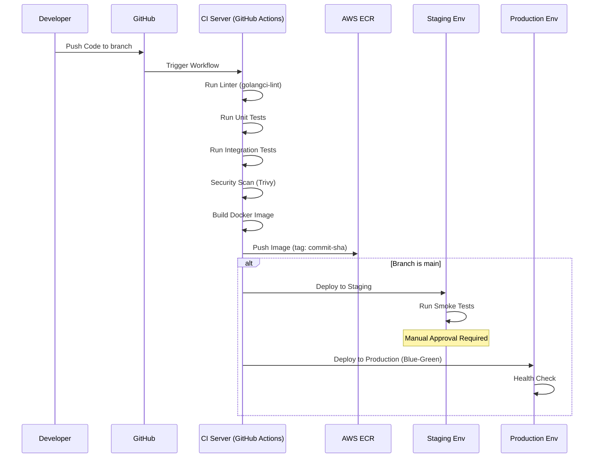

# アーキテクチャ設計書

## 1. アーキテクチャ概要
### 1.1 アーキテクチャスタイル
**採用方針**: モノリシック・レイヤードアーキテクチャ（初期フェーズ）

**採用理由**:
* **チーム規模**: 開発チーム5名程度の小〜中規模プロジェクト
* **ビジネス複雑度**: ドメインが明確で境界が曖昧でない
* **デプロイ頻度**: 週次リリースで十分（初期は品質重視）
* **運用コスト**: マイクロサービスの分散システム運用のオーバーヘッドを避ける
* **開発速度**: 初期の市場投入スピードを優先

**将来展望**: ユーザー数が10万人を超え、機能ドメインが明確に分離できる段階でマイクロサービス化を検討

### 1.2 アーキテクチャ決定記録（ADR: Architecture Decision Record）
すべてのアーキテクチャ上の重要な意思決定は、以下の形式でドキュメント化し、`docs/adr/`ディレクトリで管理します。

**ADRテンプレート**:
```markdown
# ADR-001: [タイトル]
* Status: Accepted / Superseded / Deprecated
* Date: YYYY-MM-DD
* Decision Makers: [名前]

## Context
[意思決定が必要になった背景]

## Decision
[採用した方針]

## Consequences
[この決定による影響（良い点・悪い点）]
```

**既存ADR**:
* [ADR-001: PostgreSQL採用](../adr/001-postgresql.md)
* [ADR-002: React + TypeScript採用](../adr/002-react-typescript.md)
* [ADR-003: モノリシックアーキテクチャ採用](../adr/003-monolithic-architecture.md)

## 2. 技術スタック
### 2.1 クライアントサイド
| カテゴリ | 技術・ツール | バージョン | 選定理由 |
| -- | -- | -- | -- |
| 言語 | TypeScript | 5.x | 型安全性確保のため |
| フレームワーク | React | 18.x | 開発効率とパフォーマンス |

### 2.2 サーバーサイド
| カテゴリ | 技術・ツール | バージョン | 選定理由 |
| -- | -- | -- | -- |
| 言語 | Go | 1.21 | 高速な実行速度 |
| フレームワーク | Gin | 1.9 | 軽量・高速 |

### 2.3 データベース・ストレージ
| カテゴリ | 技術・ツール | バージョン | 選定理由 |
| -- | -- | -- | -- |
| RDBMS | PostgreSQL | 15.x | 信頼性と機能性 |
| Cache | Redis | 7.x | セッション管理高速化 |

### 2.4 インフラ・環境
| カテゴリ | サービス・ツール | 用途 |
| -- | -- | -- |
| Cloud Provider | AWS | インフラ基盤 |
| Container | Docker | 開発・実行環境の統一 |

## 3. システム構成図 (C4 Model - Level 2: Container)
### 3.1 コンテナ図 (Container Diagram)
<!-- アプリケーションの実行単位（コンテナ）と、データストアの関係を示します。 -->


### 3.2 ソフトウェア構成図
<!-- 各サーバー内で動作するプロセスやミドルウェアの関係を示します。 -->


### 3.3 API Gateway構成
**採用**: Application Load Balancer (ALB) をAPI Gatewayとして使用

**機能**:
* パスベースルーティング（`/api/v1/*` → Backend Service）
* ヘルスチェック（`GET /health`）
* TLS終端（証明書はACMで管理）
* リクエストレート制限（1IP: 100 req/min）

**将来的な検討事項**: 
* API Gateway（AWS）への移行: 認証・認可、スロットリング、APIキー管理が複雑化した場合

## 4. Documentation as Code
<!-- 設計書やインフラ構成（IaC）をコードとして管理する方針 -->
* **管理方法**: すべての設計書はMarkdownで記述し、Gitリポジトリ（`docs/`ディレクトリ）で管理する。
* **図の描画**: Mermaid.jsを使用し、修正が容易な状態を維持する。
* **更新フロー**: コードへの変更Pull Requestには、対応するドキュメントの更新も含めること。

## 5. 非機能要件の実装方式
### 5.1 可用性設計
**目標値**:
* **稼働率（Availability）**: 99.9%（年間ダウンタイム: 8.76時間以内）
* **RTO（Recovery Time Objective）**: 30分以内
* **RPO（Recovery Point Objective）**: 5分以内（WALアーカイブ間隔）

**実装方式**:
* **Webサーバー**: Multi-AZ構成、ALBによる負荷分散、最小2インスタンス
* **DBサーバー**: マスタ・スタンバイ構成（自動フェイルオーバー有効）
* **キャッシュサーバー**: Redis Cluster（3ノード、レプリカ有効）
* **ヘルスチェック**: 
  - ALB → Backend: `/health`エンドポイント（10秒間隔）
  - 異常検知後の自動切り離し: 連続3回失敗時

**障害分離・サーキットブレーカー**:
* 外部API呼び出しに対してサーキットブレーカーパターンを適用
* 閾値: 10秒以内に50%以上の失敗 → Open状態（30秒間）
* ライブラリ: `sony/gobreaker`（Go実装）
* フォールバック戦略: キャッシュデータ返却 or デフォルト値返却

### 5.2 性能・拡張性設計
**目標値**:
* **レスポンスタイム**: 
  - P95: 500ms以内（API呼び出し）
  - P99: 1秒以内
* **スループット**: 1,000 req/sec（ピーク時）
* **同時接続数**: 10,000セッション

**実装方式**:
* **スケーリング戦略**:
  - 水平スケール（Scale Out）: ECS Auto Scaling（CPU 70%でスケールアウト）
  - 最小インスタンス: 2、最大: 10
* **キャッシュ戦略**:
  - マスタデータ: Redis Cache（TTL: 1時間）
  - セッション: Redis（TTL: 24時間）
  - 静的ファイル: CloudFront CDN（TTL: 7日間）
* **DB接続プール**: 最大100接続、アイドルタイムアウト: 5分
* **クエリ最適化**: 
  - スロークエリログ（1秒以上）の監視・改善
  - 必要に応じてRead Replicaの追加

### 5.3 セキュリティ設計
<!-- 具体的なセキュリティ実装方式を記述します。 -->
**ネットワークセキュリティ**:
* 通信の暗号化（TLS 1.3、証明書はACMで管理）
* VPC内でプライベートサブネット配置（DB、Redisは外部アクセス不可）
* Security Group: 最小権限の原則（Whitelist方式）
* WAF: AWS WAF導入（SQLインジェクション、XSS検出ルール）

**認証・認可**:
* 認証方式: OAuth 2.0 + JWT（HS256、有効期限: 1時間）
* リフレッシュトークン: 7日間有効、Redisで管理
* パスワードハッシュ: bcrypt（cost: 12）
* 多要素認証（MFA）: TOTP方式（オプション）

**データ保護**:
* データの暗号化（保管時）: 
  - RDS: 暗号化有効（AES-256）
  - S3: SSE-S3有効
  - 機密データ（クレカ情報等）: アプリケーションレイヤーで追加暗号化
* データの暗号化（転送時）: すべての通信をHTTPS/TLS化
* 個人情報のマスキング: ログ出力時に自動マスキング（メールアドレス: `u***@example.com`）

**セキュリティ監査**:
* CloudTrail有効化（APIコール記録）
* Config Rules: セキュリティベストプラクティス準拠チェック
* 脆弱性スキャン: Trivy（コンテナイメージ）、定期実行

### 5.4 ログ・監視設計
<!-- ログの出力先、フォーマット、監視項目、通知設定について記述します。 -->
**ログ出力方式**:
* **フォーマット**: JSON構造化ログ
* **出力先**: 標準出力（stdout） → CloudWatch Logs
* **保持期間**: 
  - アプリケーションログ: 90日間
  - アクセスログ: 1年間
  - 監査ログ: 7年間（S3にアーカイブ）

**ログレベル定義**:
| Level | 用途 | 例 |
|-------|------|-----|
| ERROR | システムエラー、例外 | DB接続失敗、外部API障害 |
| WARN | 警告、復旧可能なエラー | キャッシュミス、リトライ実行 |
| INFO | 重要な業務処理 | 注文作成、決済完了 |
| DEBUG | 詳細なデバッグ情報 | SQL実行内容（開発環境のみ） |

**監視項目・アラート**:
| 監視項目 | 閾値 | アラート方法 | 対応優先度 |
|----------|------|--------------|------------|
| API Error Rate | 5%以上 | Slack + PagerDuty | P1（即座） |
| Response Time (P95) | 1秒以上 | Slack | P2（30分以内） |
| CPU使用率 | 80%以上 | Slack | P3（監視継続） |
| メモリ使用率 | 85%以上 | Slack | P3（監視継続） |
| ディスク使用率 | 80%以上 | Slack + Email | P2（30分以内） |
| DB接続数 | 80%以上 | Slack | P2（30分以内） |

**監視ツール**:
* **メトリクス収集**: Datadog Agent（ホストメトリクス、APM）
* **アラート**: Datadog Monitors → Slack #alerts
* **ダッシュボード**: Datadog Dashboard（リアルタイムメトリクス）
* **分散トレーシング**: Datadog APM（リクエストフロー可視化）

### 5.5 バックアップ・リカバリ設計
<!-- バックアップの頻度、保持期間、リストア手順の概要を記述します。 -->
**バックアップ方針**:
| 対象 | 方式 | 頻度 | 保持期間 | RPO |
|------|------|------|----------|-----|
| RDS | 自動スナップショット + WAL | 日次（AM 3:00）+ 継続的 | 7日間 | 5分 |
| Redis | RDB + AOF | 6時間ごと | 3日間 | 6時間 |
| S3 | バージョニング有効 | リアルタイム | 30日間 | 0 |
| アプリケーション設定 | GitOps（Parameter Store） | コミット時 | 無期限 | 0 |

**リカバリ手順**:
1. **データベースリストア**:
   - RDSスナップショットから新インスタンス作成（15分）
   - WALログでPITR（Point-in-Time Recovery）実行（5分）
   - エンドポイント切り替え（5分）
   - **合計想定時間**: 25分

2. **アプリケーションリストア**:
   - 前バージョンのDockerイメージへロールバック（3分）
   - ECSタスク再起動（2分）
   - **合計想定時間**: 5分

3. **災害復旧（DR: Disaster Recovery）**:
   - リージョン障害時: マルチリージョン構成は初期フェーズでは未実装
   - データバックアップは別リージョン（東京→大阪）へクロスリージョンレプリケーション

## 6. インフラコスト見積もり
### 6.1 月次コスト試算（Production環境）
| リソース | スペック | 数量 | 単価 | 月額コスト（USD） |
|----------|----------|------|------|-------------------|
| ECS Fargate | 0.5 vCPU, 1GB RAM | 2 tasks | $15/task | $30 |
| ALB | - | 1 | $23 + データ転送 | $50 |
| RDS PostgreSQL | db.t3.medium (2vCPU, 4GB) | 1 Primary + 1 Standby | $70/instance | $140 |
| Redis ElastiCache | cache.t3.small | 3 nodes | $25/node | $75 |
| CloudFront | 1TB転送 | - | - | $85 |
| S3 | 100GB保存 + 転送 | - | - | $15 |
| CloudWatch Logs | 50GB/月 | - | - | $25 |
| Datadog | 5 hosts | - | $15/host | $75 |
| **合計** | | | | **$495/月** |

**スケールアップ時のコスト**:
* ユーザー数 10万人規模: 約 $1,500/月（ECS: 6 tasks、RDS: db.r5.large）
* ユーザー数 50万人規模: 約 $5,000/月（ECS: 20 tasks、RDS: db.r5.xlarge + Read Replica）

### 6.2 コスト最適化方針
* Reserved Instances（RI）購入: RDS（1年予約で30%削減）
* Compute Savings Plans: ECS Fargate（1年予約で20%削減）
* S3 Lifecycle Policy: 90日後にInfrequent Access、1年後にGlacier移行

## 7. 開発・運用環境
### 7.1 環境区分
| 環境名 | 用途 | 構成概要 | アクセス制限 |
| -- | -- | -- | -- |
| Development (Dev) | 開発者による機能実装・単体テスト | ローカル / 開発サーバー | 開発者のみ |
| Staging (Stg) | 本番相当環境での結合テスト・受入テスト | 本番と同等（縮小構成） | 社内限定 |
| Production (Prod) | 実運用 | フル構成 | 制限あり |

### 7.2 CI/CDパイプライン
<!-- ビルド、テスト、デプロイの自動化フローを記述します。 -->
**ツール**: GitHub Actions + AWS ECR/ECS

**パイプラインフロー**:


**デプロイ戦略**:
* **Staging**: 自動デプロイ（mainブランチへのマージ時）
* **Production**: 手動承認後、Blue-Greenデプロイメント
  - 新バージョン（Green）起動 → ヘルスチェック → トラフィック切り替え → 旧バージョン（Blue）停止
  - ロールバック時間: 3分以内（Blue環境保持）

**品質ゲート**:
* コードカバレッジ: 80%以上（gocover）
* 脆弱性: Critical/High 0件（Trivy）
* Linter: エラー 0件（golangci-lint）

## 8. エラーハンドリング方針
<!-- システム全体でのエラー検知、ログ出力、ユーザーへの応答の共通ルールを定義します。 -->

### 8.1 エラー分類と対応
| エラー種別 | HTTPステータス | ユーザー表示 | ログレベル | リトライ可否 |
|------------|----------------|--------------|------------|--------------|
| バリデーションエラー | 400 | 詳細エラーメッセージ | WARN | No |
| 認証エラー | 401 | "認証に失敗しました" | WARN | No |
| 認可エラー | 403 | "権限がありません" | WARN | No |
| リソース不存在 | 404 | "データが見つかりません" | INFO | No |
| ビジネスロジックエラー | 422 | 詳細エラーメッセージ | WARN | No |
| 外部API障害 | 503 | "一時的なエラーが発生しました" | ERROR | Yes（3回） |
| DB接続エラー | 503 | "一時的なエラーが発生しました" | ERROR | Yes（3回） |
| 予期しないエラー | 500 | "システムエラーが発生しました" | ERROR | No |

### 8.2 エラーレスポンス形式（JSON）
```json
{
  "error": {
    "code": "VALIDATION_ERROR",
    "message": "入力内容に誤りがあります",
    "details": [
      {
        "field": "email",
        "message": "メールアドレスの形式が正しくありません"
      }
    ],
    "request_id": "req_abc123xyz"
  }
}
```

### 8.3 リトライ戦略
* **指数バックオフ**: 初回1秒 → 2秒 → 4秒
* **ジッター**: ±20%のランダム遅延追加（スパイク防止）
* **タイムアウト**: 外部API 10秒、DB 5秒

## 9. 制約事項・前提条件
<!-- 技術的な制約や、特定の環境・バージョンに依存する事項があれば記述します。 -->

### 9.1 技術的制約
* **Go言語バージョン**: 1.21以降（Generics機能を使用）
* **PostgreSQLバージョン**: 15.x（14.xとの互換性なし：JSON機能の差異）
* **ブラウザサポート**: 
  - Chrome: 最新版 - 2バージョン
  - Firefox: 最新版 - 2バージョン
  - Safari: 最新版 - 1バージョン
  - IE11: サポート対象外

### 9.2 外部依存サービス
| サービス | 用途 | 障害時の影響 | フォールバック |
|----------|------|--------------|----------------|
| 決済代行API | 決済処理 | 決済不可（注文保留） | 手動決済対応 |
| メール送信API | 通知メール | メール送信不可 | キュー蓄積後リトライ |
| 画像変換API | サムネイル生成 | 元画像表示 | オリジナル画像使用 |

### 9.3 データ保持期限
* トランザクションデータ: 7年間（法令遵守）
* ログデータ: 1年間
* セッションデータ: 24時間（Redis TTL）

### 9.4 将来的な拡張予定
* マイクロサービス化の検討（ユーザー数 10万人到達時）
* GraphQL APIの導入（フロントエンドの複雑化に応じて）
* サービスメッシュ（Istio）の導入（マイクロサービス化後）

---

## 改訂履歴
| バージョン | 日付 | 変更内容 | 承認者 |
|------------|------|----------|--------|
| 1.0 | 2026-01-08 | 初版作成 | - |
