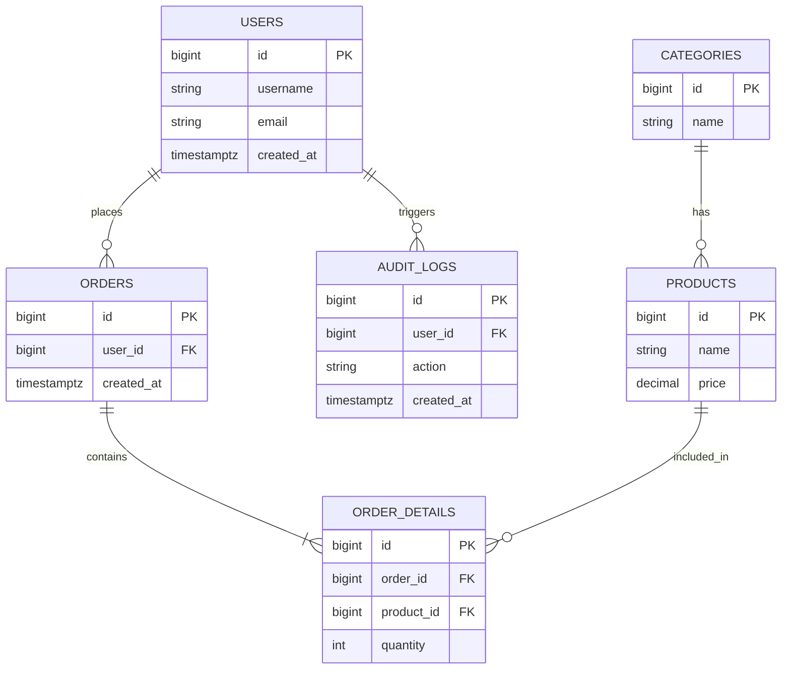

# データ設計書

## 0. ドキュメント情報
| 項目 | 内容 |
| -- | -- |
| システム名 | [System Name] |
| 対象範囲 | [対象テーブル/機能] |
| バージョン | 1.0 |
| 作成日 | YYYY-MM-DD |
| 作成者 | [Name] |
| 承認者 | [Name] |

## 1. データモデル概要
### 1.1 設計方針
**正規化レベル**: 第3正規形（3NF）を基本とする
- トランザクションテーブル: 完全正規化
- マスタテーブル: パフォーマンス要件に応じて非正規化を許容
- 集計テーブル: 意図的な非正規化（分析用途）

**命名規約**:
- テーブル: 複数形のsnake_case（例: `order_details`）
- 主キー: `id`
- 外部キー: `<table>_id`
- 監査カラム: `created_at`, `created_by`, `updated_at`, `updated_by`, `deleted_at`, `version`

**時刻の扱い**:
- DB時刻はUTCで保存し、表示はアプリケーション層でローカライズ
- 型は `TIMESTAMPTZ` を推奨

**削除方針の統一**:
| テーブル種別 | 削除方式 | 理由 |
| -- | -- | -- |
| トランザクション | 論理削除 | 監査証跡保持、復元可能性 |
| マスタ（重要） | 論理削除 | 参照整合性維持 |
| マスタ（一時） | 物理削除 | ストレージ効率 |
| ログ | 物理削除（アーカイブ後） | 保持期間経過後 |

**論理削除の実装**:
- `deleted_at TIMESTAMPTZ NULL`: NULLの場合は有効、値がある場合は削除済み
- ユニーク制約は **部分インデックス** で担保（`WHERE deleted_at IS NULL`）

**監査ログ用標準カラム**:
- `created_at TIMESTAMPTZ NOT NULL DEFAULT NOW()`
- `created_by BIGINT NULL`
- `updated_at TIMESTAMPTZ NOT NULL DEFAULT NOW()`
- `updated_by BIGINT NULL`
- `deleted_at TIMESTAMPTZ NULL`
- `version INT NOT NULL DEFAULT 1`（楽観ロック）

### 1.2 ER図 (Entity Relationship Diagram)

## 2. テーブル定義書
### 2.1 USERS (ユーザーマスタ)
**物理名**: `users`
**概要**: システムを利用するユーザー情報を管理する。

| No | 論理名 | 物理名 | 型 | 桁数 | PK | FK | NotNull | Default | 備考 |
| -- | -- | -- | -- | -- | -- | -- | -- | -- | -- |
| 1 | ユーザーID | id | BIGINT | | 〇 | | 〇 | IDENTITY | |
| 2 | ユーザー名 | username | VARCHAR | 255 | | | 〇 | |  |
| 3 | メールアドレス | email | VARCHAR | 255 | | | 〇 | | Unique (論理削除考慮) |
| 4 | 作成日時 | created_at | TIMESTAMPTZ | | | | 〇 | NOW() | |
| 5 | 更新日時 | updated_at | TIMESTAMPTZ | | | | 〇 | NOW() | |
| 6 | 削除日時 | deleted_at | TIMESTAMPTZ | | | | | | |
| 7 | バージョン | version | INT | | | | 〇 | 1 | 楽観ロック |

**インデックス**:
| インデックス名 | カラム | 種別 | 用途 |
| -- | -- | -- | -- |
| ux_users_email_active | email | Unique (partial) | `deleted_at IS NULL` |

### 2.2 ORDERS (注文テーブル)
**物理名**: `orders`
**概要**: ユーザーの注文情報を管理する。

| No | 論理名 | 物理名 | 型 | 桁数 | PK | FK | NotNull | Default | 備考 |
| -- | -- | -- | -- | -- | -- | -- | -- | -- | -- |
| 1 | 注文ID | id | BIGINT | | 〇 | | 〇 | IDENTITY | |
| 2 | ユーザーID | user_id | BIGINT | | | 〇 | 〇 | | FK: users.id |
| 3 | 注文ステータス | status | VARCHAR | 20 | | | 〇 | 'PENDING' | CHECK制約 |
| 4 | 合計金額 | total_amount | DECIMAL | 10,2 | | | 〇 | | |
| 5 | 配送先住所 | shipping_address | TEXT | | | | 〇 | | |
| 6 | 作成日時 | created_at | TIMESTAMPTZ | | | | 〇 | NOW() | |
| 7 | 作成者ID | created_by | BIGINT | | | | | | |
| 8 | 更新日時 | updated_at | TIMESTAMPTZ | | | | 〇 | NOW() | |
| 9 | 更新者ID | updated_by | BIGINT | | | | | | |
| 10 | 削除日時 | deleted_at | TIMESTAMPTZ | | | | | | |
| 11 | バージョン | version | INT | | | | 〇 | 1 | 楽観ロック |

**インデックス**:
| インデックス名 | カラム | 種別 | 用途 |
| -- | -- | -- | -- |
| idx_orders_user_id | user_id | B-Tree | ユーザーごとの注文検索 |
| idx_orders_status | status | B-Tree | ステータス別一覧 |
| idx_orders_created_at | created_at | B-Tree | 日付範囲検索 |
| idx_orders_deleted_at | deleted_at | B-Tree | 論理削除フィルタ |

**外部キー制約**:
| FK名 | 参照元カラム | 参照先テーブル.カラム | ON DELETE | ON UPDATE |
| -- | -- | -- | -- | -- |
| fk_orders_user_id | user_id | users.id | RESTRICT | CASCADE |

### 2.3 ORDER_DETAILS (注文明細テーブル)
**物理名**: `order_details`
**概要**: 注文に含まれる商品の明細情報を管理する。

| No | 論理名 | 物理名 | 型 | 桁数 | PK | FK | NotNull | Default | 備考 |
| -- | -- | -- | -- | -- | -- | -- | -- | -- | -- |
| 1 | 明細ID | id | BIGINT | | 〇 | | 〇 | IDENTITY | |
| 2 | 注文ID | order_id | BIGINT | | | 〇 | 〇 | | FK: orders.id |
| 3 | 商品ID | product_id | BIGINT | | | 〇 | 〇 | | FK: products.id |
| 4 | 数量 | quantity | INT | | | | 〇 | | |
| 5 | 単価 | unit_price | DECIMAL | 10,2 | | | 〇 | | 注文時の価格を保持 |
| 6 | 小計 | subtotal | DECIMAL | 10,2 | | | 〇 | | quantity * unit_price |
| 7 | 作成日時 | created_at | TIMESTAMPTZ | | | | 〇 | NOW() | |
| 8 | 更新日時 | updated_at | TIMESTAMPTZ | | | | 〇 | NOW() | |

**インデックス**:
| インデックス名 | カラム | 種別 | 用途 |
| -- | -- | -- | -- |
| idx_order_details_order_id | order_id | B-Tree | 注文ごとの明細取得 |
| idx_order_details_product_id | product_id | B-Tree | 商品別売上集計 |

**外部キー制約**:
| FK名 | 参照元カラム | 参照先テーブル.カラム | ON DELETE | ON UPDATE |
| -- | -- | -- | -- | -- |
| fk_order_details_order_id | order_id | orders.id | CASCADE | CASCADE |
| fk_order_details_product_id | product_id | products.id | RESTRICT | CASCADE |

### 2.4 PRODUCTS (商品マスタ)
**物理名**: `products`
**概要**: 商品情報を管理する。

| No | 論理名 | 物理名 | 型 | 桁数 | PK | FK | NotNull | Default | 備考 |
| -- | -- | -- | -- | -- | -- | -- | -- | -- | -- |
| 1 | 商品ID | id | BIGINT | | 〇 | | 〇 | IDENTITY | |
| 2 | 商品名 | name | VARCHAR | 255 | | | 〇 | | |
| 3 | 商品説明 | description | TEXT | | | | | | |
| 4 | 価格 | price | DECIMAL | 10,2 | | | 〇 | | |
| 5 | 在庫数 | stock_quantity | INT | | | | 〇 | 0 | |
| 6 | カテゴリID | category_id | BIGINT | | | 〇 | | | FK: categories.id |
| 7 | 公開ステータス | is_published | BOOLEAN | | | | 〇 | FALSE | |
| 8 | 作成日時 | created_at | TIMESTAMPTZ | | | | 〇 | NOW() | |
| 9 | 作成者ID | created_by | BIGINT | | | | | | |
| 10 | 更新日時 | updated_at | TIMESTAMPTZ | | | | 〇 | NOW() | |
| 11 | 更新者ID | updated_by | BIGINT | | | | | | |
| 12 | 削除日時 | deleted_at | TIMESTAMPTZ | | | | | | |
| 13 | バージョン | version | INT | | | | 〇 | 1 | 楽観ロック |

**インデックス**:
| インデックス名 | カラム | 種別 | 用途 |
| -- | -- | -- | -- |
| idx_products_name | name | B-Tree | 商品名検索 |
| idx_products_category_id | category_id | B-Tree | カテゴリ別一覧 |
| idx_products_is_published | is_published | B-Tree | 公開商品フィルタ |
| idx_products_deleted_at | deleted_at | B-Tree | 論理削除フィルタ |

**外部キー制約**:
| FK名 | 参照元カラム | 参照先テーブル.カラム | ON DELETE | ON UPDATE |
| -- | -- | -- | -- | -- |
| fk_products_category_id | category_id | categories.id | SET NULL | CASCADE |

### 2.5 CATEGORIES (カテゴリマスタ)
**物理名**: `categories`

| No | 論理名 | 物理名 | 型 | PK | NotNull | Default | 備考 |
| -- | -- | -- | -- | -- | -- | -- | -- |
| 1 | カテゴリID | id | BIGINT | 〇 | 〇 | IDENTITY | |
| 2 | カテゴリ名 | name | VARCHAR(100) | | 〇 | | |
| 3 | 作成日時 | created_at | TIMESTAMPTZ | | 〇 | NOW() | |
| 4 | 更新日時 | updated_at | TIMESTAMPTZ | | 〇 | NOW() | |
| 5 | 削除日時 | deleted_at | TIMESTAMPTZ | | | | |

### 2.6 AUDIT_LOGS (監査ログ)
**物理名**: `audit_logs`

| No | 論理名 | 物理名 | 型 | PK | NotNull | Default | 備考 |
| -- | -- | -- | -- | -- | -- | -- | -- |
| 1 | ログID | id | BIGINT | 〇 | 〇 | IDENTITY | |
| 2 | ユーザーID | user_id | BIGINT | | | | FK: users.id |
| 3 | アクション | action | VARCHAR(100) | | 〇 | | |
| 4 | 対象ID | target_id | BIGINT | | | | |
| 5 | メタ情報 | metadata | JSONB | | | | マスキング必須 |
| 6 | 作成日時 | created_at | TIMESTAMPTZ | | 〇 | NOW() | |

## 3. データボリューム見積もり
### 3.1 レコード数見積もり
| テーブル名 | 初期レコード数 | 月間増加数 | 年間増加数 | 3年後想定レコード数 | 見積もり根拠 |
| -- | -- | -- | -- | -- | -- |
| users | 1,000 | 100 | 1,200 | 4,600 | 既存顧客1,000名、月間100名の新規登録 |
| orders | 0 | 5,000 | 60,000 | 180,000 | 1ユーザー平均 月5回注文 × 1,000ユーザー |
| order_details | 0 | 15,000 | 180,000 | 540,000 | 1注文あたり平均3商品 |
| products | 500 | 50 | 600 | 2,300 | 初期500商品、月間50商品追加 |

### 3.2 ストレージ見積もり
| テーブル名 | 1レコードサイズ | 3年後レコード数 | 合計サイズ | インデックスサイズ | 総計 |
| -- | -- | -- | -- | -- | -- |
| users | 1 KB | 4,600 | 4.6 MB | 2 MB | 6.6 MB |
| orders | 500 Bytes | 180,000 | 90 MB | 45 MB | 135 MB |
| order_details | 200 Bytes | 540,000 | 108 MB | 54 MB | 162 MB |
| products | 2 KB | 2,300 | 4.6 MB | 2 MB | 6.6 MB |
| **合計** | | | **207.2 MB** | **103 MB** | **310.2 MB** |

**結論**: 初期段階では小規模。RDS db.t3.medium（20GB SSD）で十分。

### 3.3 パーティショニング戦略
**初期フェーズ**: パーティショニング不要

**将来的な検討事項**（レコード数が1,000万件超過時）:
- **orders テーブル**: 年月単位でパーティショニング（`created_at`）
- **order_details テーブル**: ordersと同様

### 3.4 レプリケーション・シャーディング戦略
**レプリケーション**:
- **Read Replica**: 読み取り負荷が高い場合に導入
  - 用途: レポート生成、分析クエリ
  - タイミング: 読み取りクエリがマスタのCPU 50%以上を占める場合

**シャーディング**（将来検討）:
- **シャードキー**: `user_id`
- **タイミング**: 単一DBのストレージが1TB超過時
- **方式**: アプリケーション層でのシャーディング or Citus

## 4. データ品質・制約
- ステータス系カラムはCHECK制約かENUMを使用
- 参照整合性は外部キーで担保
- `version`で楽観ロックを実装（更新時 `version = version + 1`）

## 5. プライバシー・コンプライアンス
### 5.1 データ分類
| 区分 | 例 | 保護レベル | 保管方法 |
| -- | -- | -- | -- |
| PII | メール、氏名 | 高 | 暗号化/マスキング |
| Transaction | 注文・決済 | 中 | 保管時暗号化 |
| Public | 商品一覧 | 低 | 通常保管 |

### 5.2 個人情報の取り扱い
- クレジットカード情報は保持しない（決済代行に委託）
- 分析用データは仮名化/匿名化（メールはソルト付きハッシュ）

## 6. バックアップ・ライフサイクルポリシー
### 6.1 バックアップ運用
- 日次フルバックアップ（AM 3:00）、WALアーカイブログでPITR対応
- 保管期間: トランザクション7年、ログ1年

### 6.2 データライフサイクルと削除
| データ種別 | 保存期間 | 削除タイミング | 削除方式 |
| -- | -- | -- | -- |
| 退会ユーザーデータ | 30日後 | 日次バッチ | 物理削除 |
| アクセスログ | 1年 | 月次ローテーション | アーカイブ後削除 |

## 7. データマイグレーション戦略
### 7.1 マイグレーションツール
**採用ツール**: `golang-migrate/migrate`

### 7.2 後方互換性の維持
- カラム削除は2段階（コードの参照削除→後日DDL）
- NOT NULL追加はDEFAULT設定→既存データ更新→制約追加

### 7.3 大規模データのマイグレーション
- `pg_repack`などでオンライン実行
- インデックス作成は `CONCURRENTLY`

---

## 改訂履歴
| バージョン | 日付 | 変更内容 | 承認者 |
| -- | -- | -- | -- |
| 1.0 | 2026-01-08 | 初版作成 | - |
