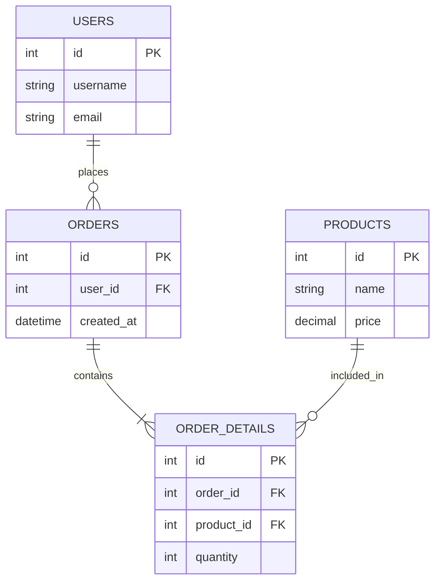

# データ設計書

## 1. データモデル概要
### 1.1 設計方針
**正規化レベル**: 第3正規形（3NF）を基本とする
* トランザクションテーブル: 完全正規化
* マスタテーブル: パフォーマンス要件に応じて非正規化を許容
* 集計テーブル: 意図的な非正規化（分析用途）

**削除方針の統一**:
| テーブル種別 | 削除方式 | 理由 |
|--------------|----------|------|
| トランザクション | 論理削除 | 監査証跡保持、復元可能性 |
| マスタ（重要） | 論理削除 | 参照整合性維持 |
| マスタ（一時） | 物理削除 | ストレージ効率 |
| ログ | 物理削除（アーカイブ後） | 保持期間経過後 |

**論理削除の実装**:
* `deleted_at TIMESTAMP NULL`: NULLの場合は有効、値がある場合は削除済み
* クエリ時は常に `WHERE deleted_at IS NULL` を条件に含める

**監査ログ用標準カラム**:
すべてのテーブルに以下のカラムを含める:
* `created_at TIMESTAMP NOT NULL DEFAULT NOW()`: 作成日時
* `created_by INTEGER`: 作成ユーザーID
* `updated_at TIMESTAMP NOT NULL DEFAULT NOW()`: 更新日時
* `updated_by INTEGER`: 更新ユーザーID
* `deleted_at TIMESTAMP NULL`: 削除日時（論理削除用）

### 1.2 ER図 (Entity Relationship Diagram)
<!-- システム全体のER図をMermaidなどで記述します。 -->


## 2. テーブル定義書
<!-- 各テーブルの詳細定義を記述します。 -->

### 2.1 USERS (ユーザーマスタ)
**論理名**: ユーザーマスタ
**物理名**: `users`
**概要**: システムを利用するユーザー情報を管理する。

| No | 論理名 | 物理名 | 型 | 桁数 | PK | FK | NotNull | Default | 備考 |
| -- | -- | -- | -- | -- | -- | -- | -- | -- | -- |
| 1 | ユーザーID | id | INT | | 〇 | | 〇 | AUTO_INC | |
| 2 | ユーザー名 | username | VARCHAR | 255 | | | 〇 | | |
| 3 | メールアドレス | email | VARCHAR | 255 | | | 〇 | | Unique |
| 4 | 作成日時 | created_at | DATETIME | | | | 〇 | NOW() | |
| 5 | 更新日時 | updated_at | DATETIME | | | | 〇 | NOW() | |

### 2.2 ORDERS (注文テーブル)
**論理名**: 注文テーブル
**物理名**: `orders`
**概要**: ユーザーの注文情報を管理する。

| No | 論理名 | 物理名 | 型 | 桁数 | PK | FK | NotNull | Default | 備考 |
| -- | -- | -- | -- | -- | -- | -- | -- | -- | -- |
| 1 | 注文ID | id | BIGINT | | 〇 | | 〇 | AUTO_INC | |
| 2 | ユーザーID | user_id | INT | | | 〇 | 〇 | | FK: users.id |
| 3 | 注文ステータス | status | VARCHAR | 20 | | | 〇 | 'PENDING' | PENDING/CONFIRMED/SHIPPED/DELIVERED/CANCELLED |
| 4 | 合計金額 | total_amount | DECIMAL | 10,2 | | | 〇 | | |
| 5 | 配送先住所 | shipping_address | TEXT | | | | 〇 | | |
| 6 | 作成日時 | created_at | TIMESTAMP | | | | 〇 | NOW() | |
| 7 | 作成者ID | created_by | INT | | | | | | |
| 8 | 更新日時 | updated_at | TIMESTAMP | | | | 〇 | NOW() | |
| 9 | 更新者ID | updated_by | INT | | | | | | |
| 10 | 削除日時 | deleted_at | TIMESTAMP | | | | | | 論理削除 |

**インデックス**:
| インデックス名 | カラム | 種別 | 用途 |
| -- | -- | -- | -- |
| idx_orders_user_id | user_id | B-Tree | ユーザーごとの注文検索 |
| idx_orders_status | status | B-Tree | ステータス別一覧 |
| idx_orders_created_at | created_at | B-Tree | 日付範囲検索 |
| idx_orders_deleted_at | deleted_at | B-Tree | 論理削除フィルタ |

**外部キー制約**:
| FK名 | 参照元カラム | 参照先テーブル.カラム | ON DELETE | ON UPDATE |
| -- | -- | -- | -- | -- |
| fk_orders_user_id | user_id | users.id | RESTRICT | CASCADE |

### 2.3 ORDER_DETAILS (注文明細テーブル)
**論理名**: 注文明細テーブル
**物理名**: `order_details`
**概要**: 注文に含まれる商品の明細情報を管理する。

| No | 論理名 | 物理名 | 型 | 桁数 | PK | FK | NotNull | Default | 備考 |
| -- | -- | -- | -- | -- | -- | -- | -- | -- | -- |
| 1 | 明細ID | id | BIGINT | | 〇 | | 〇 | AUTO_INC | |
| 2 | 注文ID | order_id | BIGINT | | | 〇 | 〇 | | FK: orders.id |
| 3 | 商品ID | product_id | INT | | | 〇 | 〇 | | FK: products.id |
| 4 | 数量 | quantity | INT | | | | 〇 | | |
| 5 | 単価 | unit_price | DECIMAL | 10,2 | | | 〇 | | 注文時の価格を保持 |
| 6 | 小計 | subtotal | DECIMAL | 10,2 | | | 〇 | | quantity * unit_price |
| 7 | 作成日時 | created_at | TIMESTAMP | | | | 〇 | NOW() | |
| 8 | 更新日時 | updated_at | TIMESTAMP | | | | 〇 | NOW() | |

**インデックス**:
| インデックス名 | カラム | 種別 | 用途 |
| -- | -- | -- | -- |
| idx_order_details_order_id | order_id | B-Tree | 注文ごとの明細取得 |
| idx_order_details_product_id | product_id | B-Tree | 商品別売上集計 |

**外部キー制約**:
| FK名 | 参照元カラム | 参照先テーブル.カラム | ON DELETE | ON UPDATE |
| -- | -- | -- | -- | -- |
| fk_order_details_order_id | order_id | orders.id | CASCADE | CASCADE |
| fk_order_details_product_id | product_id | products.id | RESTRICT | CASCADE |

### 2.4 PRODUCTS (商品マスタ)
**論理名**: 商品マスタ
**物理名**: `products`
**概要**: 商品情報を管理する。

| No | 論理名 | 物理名 | 型 | 桁数 | PK | FK | NotNull | Default | 備考 |
| -- | -- | -- | -- | -- | -- | -- | -- | -- | -- |
| 1 | 商品ID | id | INT | | 〇 | | 〇 | AUTO_INC | |
| 2 | 商品名 | name | VARCHAR | 255 | | | 〇 | | |
| 3 | 商品説明 | description | TEXT | | | | | | |
| 4 | 価格 | price | DECIMAL | 10,2 | | | 〇 | | |
| 5 | 在庫数 | stock_quantity | INT | | | | 〇 | 0 | |
| 6 | カテゴリID | category_id | INT | | | 〇 | | | FK: categories.id |
| 7 | 公開ステータス | is_published | BOOLEAN | | | | 〇 | FALSE | |
| 8 | 作成日時 | created_at | TIMESTAMP | | | | 〇 | NOW() | |
| 9 | 作成者ID | created_by | INT | | | | | | |
| 10 | 更新日時 | updated_at | TIMESTAMP | | | | 〇 | NOW() | |
| 11 | 更新者ID | updated_by | INT | | | | | | |
| 12 | 削除日時 | deleted_at | TIMESTAMP | | | | | | 論理削除 |

**インデックス**:
| インデックス名 | カラム | 種別 | 用途 |
| -- | -- | -- | -- |
| idx_products_name | name | B-Tree | 商品名検索 |
| idx_products_category_id | category_id | B-Tree | カテゴリ別一覧 |
| idx_products_is_published | is_published | B-Tree | 公開商品フィルタ |
| idx_products_deleted_at | deleted_at | B-Tree | 論理削除フィルタ |

**外部キー制約**:
| FK名 | 参照元カラム | 参照先テーブル.カラム | ON DELETE | ON UPDATE |
| -- | -- | -- | -- | -- |
| fk_products_category_id | category_id | categories.id | SET NULL | CASCADE |

## 3. データボリューム見積もり
### 3.1 レコード数見積もり
| テーブル名 | 初期レコード数 | 月間増加数 | 年間増加数 | 3年後想定レコード数 | 見積もり根拠 |
| -- | -- | -- | -- | -- | -- |
| users | 1,000 | 100 | 1,200 | 4,600 | 既存顧客1,000名、月間100名の新規登録 |
| orders | 0 | 5,000 | 60,000 | 180,000 | 1ユーザー平均 月5回注文 × 1,000ユーザー |
| order_details | 0 | 15,000 | 180,000 | 540,000 | 1注文あたり平均3商品 |
| products | 500 | 50 | 600 | 2,300 | 初期500商品、月間50商品追加 |

### 3.2 ストレージ見積もり
| テーブル名 | 1レコードサイズ | 3年後レコード数 | 合計サイズ | インデックスサイズ | 総計 |
| -- | -- | -- | -- | -- | -- |
| users | 1 KB | 4,600 | 4.6 MB | 2 MB | 6.6 MB |
| orders | 500 Bytes | 180,000 | 90 MB | 45 MB | 135 MB |
| order_details | 200 Bytes | 540,000 | 108 MB | 54 MB | 162 MB |
| products | 2 KB | 2,300 | 4.6 MB | 2 MB | 6.6 MB |
| **合計** | | | **207.2 MB** | **103 MB** | **310.2 MB** |

**結論**: 初期段階では小規模。RDS db.t3.medium（20GB SSD）で十分。

### 3.3 パーティショニング戦略
**初期フェーズ**: パーティショニング不要

**将来的な検討事項**（レコード数が1,000万件超過時）:
* **orders テーブル**: 年月単位でパーティショニング（`created_at`）
  - 例: `orders_2026_01`, `orders_2026_02`, ...
  - 古いパーティションはアーカイブ or 削除
* **order_details テーブル**: ordersと同様

### 3.4 レプリケーション・シャーディング戦略
**レプリケーション**:
* **Read Replica**: 読み取り負荷が高い場合に導入
  - 用途: レポート生成、分析クエリ
  - タイミング: 読み取りクエリがマスタのCPU 50%以上を占める場合

**シャーディング**（将来検討）:
* **シャードキー**: `user_id`（ユーザーごとにデータ分散）
* **タイミング**: 単一DBのストレージが1TB超過時
* **方式**: アプリケーション層でのシャーディング or Citus（PostgreSQL拡張）

## 4. バックアップ・ライフサイクルポリシー
### 4.1 バックアップ運用
* **バックアップ**: 日次フルバックアップ（AM 3:00）、WALアーカイブログによるPITR対応
* **保存期間**: 
    - トランザクションデータ: 7年
    - ログデータ: 1年

### 4.2 データライフサイクルと削除
<!-- データの発生から廃棄までの流れを定義します。 -->
| データ種別 | 保存期間 | 削除タイミング | 削除方式 |
| -- | -- | -- | -- |
| 退会ユーザーデータ | 30日後 | 日次バッチ | 物理削除 |
| アクセスログ | 1年 | 月次ローテーション | アーカイブ後削除 |

### 4.3 プライバシー・コンプライアンス（個人情報保護）
<!-- GDPR/APPIなどの法規制への対応方針。 -->
**個人情報の取り扱い**:
* 特定個人情報（マイナンバー等）: 本システムでは保持しない
* クレジットカード情報: トークン化（決済代行に委託、PCI DSS準拠）
* データの匿名化・仮名化: 分析用データエクスポート時に個人特定要素をハッシュ化する
  - メールアドレス: SHA-256ハッシュ化
  - 氏名: 仮名化（"ユーザー001"など）

**GDPR/APPI対応**:
* データポータビリティ: ユーザーデータのエクスポート機能（JSON形式）
* 削除権（忘れられる権利）: 論理削除後30日間の保持、その後物理削除
* アクセスログ: 個人情報へのアクセス履歴を記録（`audit_logs`テーブル）

## 5. データマイグレーション戦略
### 5.1 マイグレーションツール
**採用ツール**: `golang-migrate/migrate`

**マイグレーションファイル構成**:
```
migrations/
├── 000001_create_users_table.up.sql
├── 000001_create_users_table.down.sql
├── 000002_create_orders_table.up.sql
├── 000002_create_orders_table.down.sql
└── ...
```

### 5.2 マイグレーション実行フロー
**開発環境**:
1. 開発者がマイグレーションファイル作成
2. ローカルで `migrate up` 実行・検証
3. Pull Request作成（レビュー）
4. マージ後、CI/CDでStaging環境へ自動適用

**本番環境**:
1. メンテナンスウィンドウ設定（深夜帯）
2. バックアップ取得（自動スナップショット）
3. マイグレーション実行（手動トリガー）
4. エラー時は `migrate down` でロールバック
5. 動作確認後、メンテナンス解除

### 5.3 後方互換性の維持
**破壊的変更の回避**:
* カラム削除: 2段階マイグレーション
  1. アプリケーションコードから参照削除 → デプロイ
  2. 次回リリースでカラム削除
* カラム名変更: 新カラム追加 → 移行期間 → 旧カラム削除
* NOT NULL制約追加: DEFAULT値設定 → 既存データ更新 → 制約追加

### 5.4 大規模データのマイグレーション
**方針**: ダウンタイムを最小化
* **オンラインマイグレーション**: `pg_repack`（テーブル再構築）
* **バッチ処理**: 大量データ更新は分割実行（1,000件ずつCOMMIT）
* **インデックス作成**: `CONCURRENTLY`オプション使用（ロックフリー）

---

## 改訂履歴
| バージョン | 日付 | 変更内容 | 承認者 |
|------------|------|----------|--------|
| 1.0 | 2026-01-08 | 初版作成 | - |
