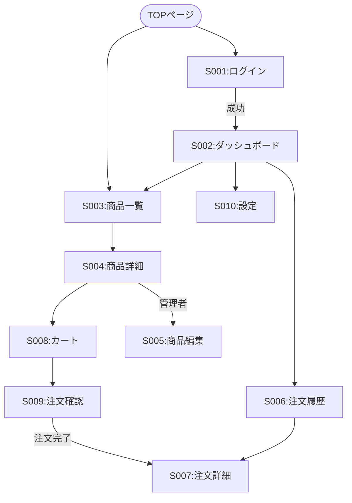

# 画面設計書

## 1. 画面一覧
| 画面ID | 画面名称 | 概要 | 権限 | URLパス | 備考 |
| -- | -- | -- | -- | -- | -- |
| S001 | ログイン画面 | ユーザー認証を行う | 全員 | `/login` | |
| S002 | ダッシュボード | 概要情報を表示する | ログインユーザー | `/dashboard` | |
| S003 | 商品一覧画面 | 商品の一覧を表示 | 全員 | `/products` | |
| S004 | 商品詳細画面 | 商品の詳細情報を表示 | 全員 | `/products/:id` | |
| S005 | 商品編集画面 | 商品情報を編集 | 管理者 | `/products/:id/edit` | |
| S006 | 注文履歴画面 | ユーザーの注文履歴を表示 | ログインユーザー | `/orders` | |
| S007 | 注文詳細画面 | 注文の詳細情報を表示 | ログインユーザー | `/orders/:id` | |
| S008 | カート画面 | 購入する商品を管理 | 全員 | `/cart` | |
| S009 | 注文確認画面 | 注文内容を確認 | ログインユーザー | `/checkout` | |
| S010 | ユーザー設定画面 | プロフィール情報を編集 | ログインユーザー | `/settings` | |

### 1.1 権限マトリクス
| 画面ID | 画面名称 | ゲスト | 一般ユーザー | 管理者 | 備考 |
| -- | -- | -- | -- | -- | -- |
| S001 | ログイン画面 | ✓ | ✓ | ✓ | ログイン済みはリダイレクト |
| S002 | ダッシュボード | ✕ | ✓ | ✓ | |
| S003 | 商品一覧画面 | ✓ | ✓ | ✓ | |
| S004 | 商品詳細画面 | ✓ | ✓ | ✓ | |
| S005 | 商品編集画面 | ✕ | ✕ | ✓ | 403 Forbidden表示 |
| S006 | 注文履歴画面 | ✕ | ✓ | ✓ | 自分の注文のみ表示 |
| S007 | 注文詳細画面 | ✕ | ✓ | ✓ | 自分の注文のみ表示 |
| S008 | カート画面 | ✓ | ✓ | ✓ | ゲストカート対応 |
| S009 | 注文確認画面 | ✕ | ✓ | ✓ | ログイン必須 |
| S010 | ユーザー設定画面 | ✕ | ✓ | ✓ | |

## 2. 画面遷移図
<!-- 画面間の遷移フローを記述します。 -->

## 3. 共通仕様
### 3.1 ヘッダー・フッター
<!-- 全画面共通のヘッダー・フッターのデザインや機能を記述します。 -->
**ヘッダー構成**:
* ロゴ（左上、クリックでTOPへ）
* グローバルナビゲーション：商品一覧、カート、マイページ
* 検索ボックス（中央）
* ユーザーメニュー（右上）：プロフィール、設定、ログアウト
* カートアイコン（バッジ：商品数表示）

**フッター構成**:
* 企業情報リンク
* 利用規約、プライバシーポリシー
* SNSリンク
* 著作権表示

### 3.2 共通エラーメッセージ
<!-- エラー発生時の共通的な表示などの仕様を記述します。 -->

#### 3.2.1 エラー表示方式
* **トースト通知**：画面右上から3秒間表示（自動消去）
* **インラインアラート**：フォーム直上に表示（手動で閉じる）
* **フィールドエラー**：入力欄下に赤文字で表示

#### 3.2.2 エラーメッセージ一覧
| エラーコード | メッセージ | 表示方式 | 発生タイミング |
| -- | -- | -- | -- |
| E001 | 入力内容に誤りがあります | インライン | バリデーションエラー |
| E002 | ログインに失敗しました。メールアドレスまたはパスワードが正しくありません | トースト | 認証失敗 |
| E003 | セッションが期限切れです。再度ログインしてください | トースト | セッションタイムアウト |
| E004 | この操作を実行する権限がありません | インライン | 認可エラー |
| E005 | データが見つかりませんでした | インライン | 404 Not Found |
| E006 | 一時的なエラーが発生しました。しばらくしてから再度お試しください | トースト | サーバーエラー |
| E007 | ネットワークエラーが発生しました。接続を確認してください | トースト | ネットワーク障害 |
| E008 | 在庫が不足しています | インライン | 在庫不足 |

### 3.3 ページネーション・ソート・フィルタ
<!-- 一覧画面における共通の挙動を定義します。 -->
**ページネーション**:
* デフォルト: 20件/ページ
* 表示件数変更: 10/20/50/100件
* ページャー位置: 一覧下部および上部
* 無限スクロールは不採用（SEO対策）

**ソート**:
* デフォルト: 作成日時降順
* カラムヘッダークリックでソート切り替え
* 矢印アイコンで昇順・降順表示

**フィルタ**:
* 検索ボックス: リアルタイム検索（300msのデバウンス）
* 適用中フィルターをバッジ表示（削除可能）

### 3.4 アクセシビリティ・レスポンシブ方針
<!-- WCAG 2.1 Level AA準拠などの目標や、デバイスごとの表示方針について記述します。 -->
* **アクセシビリティ**: コントラスト比 4.5:1以上確保、スクリーンリーダー対応（適切なaria-label）。
* **レスポンシブ**: PC (Breakpoints > 1024px) / Tablet / Mobile (Breakpoints < 768px) 対応。

### 3.5 インタラクション状態 (States)
<!-- UIの各状態における表示ルールを定義します。 -->
* **Default**: 初期表示状態。
* **Loading**: データ取得中の読み込み表示（スケルトンスクリーン推奨）。
* **Empty**: データが0件の場合の「データがありません」表示とアクション（登録ボタン等）。
* **Error**: エラー発生時のトースト通知またはインラインアラート表示。

### 3.6 セキュリティ対策
**入力値のサニタイズ**:
* フロントエンドでのHTMLエスケープ（DOMPurifyライブラリ使用）
* バックエンドでの再バリデーションとエスケープ

**XSS対策**:
* Content Security Policy (CSP) ヘッダー設定
* ユーザー入力値を`dangerouslySetInnerHTML`で出力しない
* テキストノードでの出力を基本とする

**CSRF対策**:
* CSRFトークンの生成・検証
* SameSite Cookie属性を`Strict`に設定

**クリックジャッキング対策**:
* X-Frame-Options: DENY ヘッダー設定
* iframeでの埋め込みを禁止

### 3.7 キーボードショートカット
| キー操作 | 機能 | 対象画面 |
| -- | -- | -- |
| `/` | 検索ボックスにフォーカス | 全画面 |
| `Esc` | モーダル/ドロワーを閉じる | 全画面 |
| `Ctrl + K` | コマンドパレット表示 | 全画面 |
| `Tab` | 次の要素にフォーカス | 全画面 |
| `Shift + Tab` | 前の要素にフォーカス | 全画面 |
| `Enter` | フォーム送信 / ボタン実行 | 入力フォーム |
| `← →` | ページネーション | 一覧画面 |

### 3.8 多言語対応 (i18n)
**サポート言語**:
* 初期フェーズ: 日本語のみ
* 将来対応: 英語、中国語（簡体）

**実装方式**:
* ライブラリ: `react-i18next`
* 翻訳ファイル: JSON形式（`/locales/ja.json`, `/locales/en.json`）
* 言語切り替え: ヘッダーの言語選択ドロップダウン
* ブラウザ言語設定の自動検出

**注意事項**:
* 日付・時刻フォーマットのロケール対応（`Intl.DateTimeFormat`）
* 数値・通貨フォーマットのロケール対応（`Intl.NumberFormat`）
* RTL言語（アラビア語等）は初期フェーズでは未対応

### 3.9 パフォーマンス指標
**目標値**:
| 指標 | 目標 | 計測方法 |
| -- | -- | -- |
| First Contentful Paint (FCP) | 1.5秒以内 | Lighthouse |
| Largest Contentful Paint (LCP) | 2.5秒以内 | Lighthouse |
| Time to Interactive (TTI) | 3.5秒以内 | Lighthouse |
| Cumulative Layout Shift (CLS) | 0.1以下 | Lighthouse |
| Total Blocking Time (TBT) | 300ms以下 | Lighthouse |

**最適化方針**:
* Code Splitting: ルートごとのReact.lazy
* 画像最適化: WebP形式、遅延ロード（Intersection Observer）
* CSS/JSのMinify、Gzip/Brotli圧縮
* Critical CSSのインライン化
* Service Workerでのキャッシュ戦略

### 3.10 デザインシステム
**コンポーネントライブラリ**: Material-UI (MUI) v5

**カラーパレット**:
* Primary: `#1976d2` (青)
* Secondary: `#dc004e` (赤)
* Success: `#4caf50` (緑)
* Error: `#f44336` (赤)
* Warning: `#ff9800` (オレンジ)
* Info: `#2196f3` (水色)

**タイポグラフィ**:
* フォントファミリー: Noto Sans JP, sans-serif
* ベースフォントサイズ: 16px
* 行間: 1.5

**スペーシング**:
* ベース単位: 8px
* スペーシングスケール: 0.5x, 1x, 2x, 3x, 4x, 6x, 8x (4px, 8px, 16px, 24px, 32px, 48px, 64px)

**共通コンポーネント**:
* Button: Primary, Secondary, Outlined, Text
* TextField: Standard, Outlined, Filled
* Card: シャドウ付きコンテナ
* Alert: Success, Error, Warning, Info
* Modal: センタリングダイアログ
* Drawer: 左/右からスライド

**Storybookでコンポーネント管理**: 開発者向けドキュメントとして活用

## 4. 画面詳細定義
<!-- 画面ごとに章を設けて詳細を記述します。 -->

### 4.1 [S001] ログイン画面
#### 4.1.1 画面レイアウト概要
<!-- ワイヤーフレームの画像貼付、またはテキストでのレイアウト説明。 -->
* ロゴ画像（中央上）
* ユーザーID入力欄
* パスワード入力欄
* ログインボタン
* パスワード忘れリンク

#### 4.1.2 画面項目定義
| No | 項目名 | 形式 | 必須 | 初期値 | 入力規則・バリデーション | 備考 |
| -- | -- | -- | -- | -- | -- | -- |
| 1 | ユーザーID | Text | 〇 | なし | アルファベット小文字、数字、記号 | |
| 2 | パスワード | Password | 〇 | なし | 8文字以上 | |
| 3 | ログイン | Button | - | - | クリックで認証処理を実行 | |

#### 4.1.3 イベント・アクション定義
| イベント | トリガー | 処理概要 | 遷移先 |
| -- | -- | -- | -- |
| ログインボタン押下 | Click | `POST /api/login` を呼び出す。 成功時: トークン保存して遷移。 失敗時: エラーメッセージ表示。 | 成功: ダッシュボード 失敗: 自画面 |

---
### 4.2 [S002] ダッシュボード
<!-- 以下同様に記述 -->

---

## 改訂履歴
| バージョン | 日付 | 変更内容 | 承認者 |
|------------|------|----------|--------|
| 1.0 | 2026-01-08 | 初版作成 | - |
