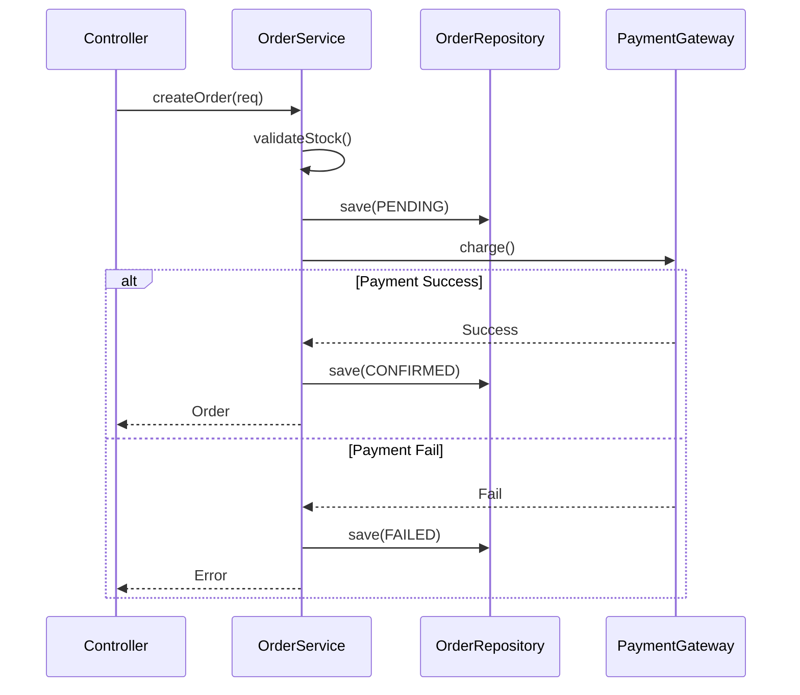

# 詳細設計書

## 1. モジュール一覧
| モジュールID | 名称 | 概要 | 責任 | 担当 |
| -- | -- | -- | -- | -- |
| M001 | OrderService | 注文処理ロジック | 注文の作成・更新・検証 | サーバー |
| M002 | PaymentGateway | 決済連携アダプタ | 外部決済APIとの通信 | サーバー |
| M003 | InventoryService | 在庫管理サービス | 在庫の確認・引き当て・解放 | サーバー |
| M004 | UserAuthService | ユーザー認証サービス | ログイン・ログアウト・JWT発行 | サーバー |
| M005 | EmailNotificationService | メール通知サービス | 非同期メール送信 | サーバー |
| M006 | CacheManager | キャッシュ管理 | Redisキャッシュの読み書き | サーバー |

## 2. 詳細設計詳細

### 2.1 [M001] OrderService
#### 2.1.1 クラス設計
**Class**: `OrderService`
**Package**: `com.example.service`

**Dependencies (DI)**:
* `OrderRepository`: 注文データアクセス
* `InventoryService`: 在庫サービス
* `PaymentGateway`: 決済連携
* `EmailNotificationService`: メール通知
* `Logger`: ロギング

**Methods**
| 修飾子 | 返り値 | メソッド名 | 引数 | 概要 | 例外 |
| -- | -- | -- | -- | -- | -- |
| public | Order | createOrder | OrderRequest req | 注文を作成する | InvalidRequestException, OutOfStockException, PaymentFailedException |
| private | void | validateStock | int productId, int quantity | 在庫チェック | OutOfStockException |
| public | Order | getOrder | int orderId, int userId | 注文詳細を取得 | OrderNotFoundException, UnauthorizedException |
| public | void | cancelOrder | int orderId, int userId | 注文をキャンセル | OrderNotFoundException, InvalidStatusException |

#### 2.1.1a データ型定義
**OrderRequest (Input)**:
```go
type OrderRequest struct {
    UserID          int                `json:"user_id" validate:"required,min=1"`
    Items           []OrderItem        `json:"items" validate:"required,min=1,dive"`
    ShippingAddress ShippingAddress    `json:"shipping_address" validate:"required"`
    PaymentMethod   string             `json:"payment_method" validate:"required,oneof=credit_card bank_transfer"`
}

type OrderItem struct {
    ProductID int `json:"product_id" validate:"required,min=1"`
    Quantity  int `json:"quantity" validate:"required,min=1,max=99"`
}
```

**Order (Output)**:
```go
type Order struct {
    ID              int       `json:"id"`
    UserID          int       `json:"user_id"`
    Status          string    `json:"status"` // PENDING, CONFIRMED, SHIPPED, DELIVERED, CANCELLED
    TotalAmount     float64   `json:"total_amount"`
    ShippingAddress string    `json:"shipping_address"`
    CreatedAt       time.Time `json:"created_at"`
}
```

#### 2.1.2 処理ロジック (createOrder)
**トランザクション境界**: メソッド全体をトランザクションで囲む（`@Transactional`）

1. **入力バリデーション**:
   - **処理**: `OrderRequest`の必須項目チェック、値範囲検証
   - **ログ**: `INFO` - 「Order creation started: userID={req.UserID}」
   - **不正な場合**: `InvalidRequestException`をスロー
   - **ログ**: `WARN` - 「Validation failed: {error details}」

2. **在庫確保**:
   - **処理**: `InventoryService.reserveStock(productId, quantity)` 呼び出し
   - **ログ**: `DEBUG` - 「Reserving stock: productID={productId}, quantity={quantity}」
   - **在庫不足時**: `OutOfStockException`をスロー
   - **ログ**: `WARN` - 「Out of stock: productID={productId}」
   - **ロールバック**: トランザクション自動ロールバック

3. **注文データ保存**:
   - **処理**: `OrderRepository.save(order)` でDBにステータス「PENDING」で保存
   - **ログ**: `INFO` - 「Order saved: orderID={order.ID}, status=PENDING」

4. **決済処理**:
   - **処理**: `PaymentGateway.charge(orderID, amount, paymentMethod)` 呼び出し
   - **ログ**: `INFO` - 「Payment initiated: orderID={order.ID}, amount={amount}」
   - **失敗時**: 
     - DBのステータスを「FAILED」に更新
     - 在庫を解放: `InventoryService.releaseStock()`
     - `PaymentFailedException`をスロー
     - **ログ**: `ERROR` - 「Payment failed: orderID={order.ID}, error={error}」
     - **ロールバック**: トランザクション自動ロールバック
   - **成功時**: 
     - DBのステータスを「CONFIRMED」に更新
     - **ログ**: `INFO` - 「Payment succeeded: orderID={order.ID}」

5. **完了メール送信**:
   - **処理**: `EmailNotificationService.sendOrderConfirmation(order)` を非同期でキューイング
   - **ログ**: `DEBUG` - 「Email queued: orderID={order.ID}」
   - **注意**: メール送信失敗はトランザクションをロールバックさせない

6. **戻り値**: 作成された`Order`オブジェクトを返す
   - **ログ**: `INFO` - 「Order created successfully: orderID={order.ID}」

#### 2.1.2a 例外処理詳細
**例外階層**:
```
Exception (base)
├─ BusinessException
│   ├─ InvalidRequestException (400)
│   ├─ OutOfStockException (422)
│   ├─ PaymentFailedException (402)
│   ├─ OrderNotFoundException (404)
│   └─ UnauthorizedException (403)
└─ SystemException
    ├─ DatabaseException (500)
    └─ ExternalApiException (503)
```

**例外ハンドリング**:
* `BusinessException`: Controller層でキャッチ、適切なHTTPステータスで返却
* `SystemException`: グローバルエラーハンドラーで500エラー返却
* すべての例外は `request_id` を含む

#### 2.1.2b 並行処理・排他制御
**同時注文時の在庫競合**:
* **対策**: 商品テーブルの`stock_quantity`カラムに楽観ロック (Optimistic Locking)
* **実装**: `version`カラムを追加、UPDATE時にバージョンチェック
* **競合検出時**: `OutOfStockException`をスロー、フロントエンドでリトライ

**デッドロック防止**:
* テーブルアクセス順序を統一: products → orders → order_details
* タイムアウト設定: トランザクションタイムアウト 5秒

#### 2.1.2c パフォーマンス要件
* **目標値**: 注文作成処理 500ms以内 (P95)
* **ボトルネック**: 決済API呼び出し (外部依存)
* **最適化**:
  - 在庫情報をRedisキャッシュ (TTL: 30秒)
  - N+1問題防止: 商品情報を一括取得
  - DBコネクションプール使用

#### 2.1.2d テスト観点
**ユニットテスト**:
* 正常系: 有効なリクエストで注文が作成される
* 異常系: バリデーションエラー、在庫不足、決済失敗
* モック: `PaymentGateway`, `InventoryService`, `EmailNotificationService`
* カバレッジ: 90%以上

**統合テスト**:
* トランザクションのロールバック検証
* 同時実行時の競合状態検証
* 外部API障害時のリトライ動作

#### 2.1.3 シーケンス図


---

## 3. キャッシュ戦略
### 3.1 キャッシュ対象データ
| データ種別 | キー形式 | TTL | 無効化タイミング |
| -- | -- | -- | -- |
| 商品情報 | `product:{id}` | 1時間 | 商品更新時 |
| 在庫情報 | `stock:{product_id}` | 30秒 | 在庫変更時 |
| ユーザーセッション | `session:{user_id}` | 24時間 | ログアウト時 |
| カテゴリ一覧 | `categories:all` | 12時間 | カテゴリ追加時 |

### 3.2 キャッシュ無効化パターン
**Write-Through**:
* データ更新時、DBとキャッシュを同時に更新
* 例: 商品情報編集時

**Cache-Aside**:
* 読み取り時、キャッシュミスでDB参照 → キャッシュに保存
* 例: 商品詳細表示

**Time-Based Expiration**:
* TTL経過で自動削除
* 例: 在庫情報 (30秒)

### 3.3 キャッシュスタンピード対策
* 人気商品のプリロード (アプリ起動時)
* キャッシュウォーミング: 新バージョンデプロイ前にキャッシュヒート

---

## 4. 依存性注入 (DI) 設計
### 4.1 DIコンテナ
**フレームワーク**: Wire (Go用DIツール)

**コンポーネントライフサイクル**:
* **Singleton**: Repository, Service, Gateway (アプリ起動時に1度生成)
* **Request Scoped**: Controller (リクエストごとに生成)

### 4.2 インターフェース分離
**メリット**:
* テスト容易性: モックの差し替えが簡単
* 柔軟性: 実装の切り替えが容易

**例**: 
```go
// Interface
type PaymentGateway interface {
    Charge(orderID int, amount float64, method string) error
}

// Implementation
type StripePaymentGateway struct {}
func (s *StripePaymentGateway) Charge(...) error { /*...*/ }

// Mock for testing
type MockPaymentGateway struct {}
func (m *MockPaymentGateway) Charge(...) error { return nil }
```

---

## 改訂履歴
| バージョン | 日付 | 変更内容 | 承認者 |
|------------|------|----------|--------|
| 1.0 | 2026-01-08 | 初版作成 | - |
