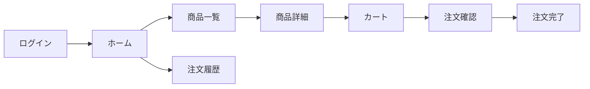

# 1. 概要

## 1.1 目的

* チームで並行実装しつつ、依存関係を崩さず効率的に開発する
* この計画書をもとにメンバーへ **ざっくりタスク** を割り振る（詳細タスクは各ブランチ/Issueで作成）
* 設計ドキュメントに基づき、手戻りのない実装ラインを構築する
* この計画書をもとにメンバーへタスクを割り振り、進捗を管理する

## 1.2 成果物（最終ゴール）

* リリース対象: <Webアプリケーション>, <APIサーバー>

  * 例: Web（Next.js）, API（Go/Node.js）
* リリース形態: 初期リリース (MVP)
* リリース日（目標）: YYYY-MM-DD

## 1.3 スコープ

### In Scope

* <機能を列挙>

  * 例: **ユーザー・認証**: 登録(F-01)、ログイン(F-02)、マイページ(F-03)
  * 例: **商品**: 商品一覧、商品詳細、在庫管理
  * 例: **注文**: 注文作成、注文履歴
  * 例: **管理機能**: 商品管理ダッシュボード

### Out of Scope（今回やらない）

* 例: 決済ゲートウェイ連携（モックで対応）
* 例: 複雑なプロモーション/クーポン機能
* 例: 高度な分析・レポーティング基盤

## 1.4 前提・制約

* 技術スタック:

  * Frontend: Next.js / React
  * Backend: Go (or Node.js)
  * Database: PostgreSQL
  * Infra: Docker / AWS/GCP
* アーキテクチャ: レイヤードアーキテクチャ (Presentation, Application, Domain, Infrastructure)

## 1.5 参照ドキュメント

* 例: `templates/design/01_basic_design.md`（機能一覧 / 画面遷移）
* 例: `templates/design/screen/<feature-name>_screen_design.md`（画面仕様）
* 例: `templates/design/db/03_db_design.md`（ER図 / テーブル定義）
* 例: `templates/design/02_api_design.md`（API IF / OpenAPI）
* 例: `templates/design/04_architecture_design.md`（アーキテクチャ / ディレクトリ構成）
* 例: `templates/design/05_non_functional_requirements.md`（非機能要件）
* 例: `templates/design/09_roles_permissions.md`（権限 / ロール）

---

# 2. 依存関係の整理（最重要）

## 3.1 機能・画面一覧（カタログ）

> ここで「何があるか」と「依存」を固定し、実装順と並行作業を成立させる。

### 機能カタログ（例）

* [F-01] 認証
* [F-02] ユーザー設定
* [F-03] 商品一覧
* [F-04] 商品詳細
* [F-05] 注文作成
* [F-06] 注文履歴
* [F-07] 管理：商品管理
* [F-08] 管理：注文管理

### 画面カタログ（例）

* [S-01] ログイン
* [S-02] ホーム
* [S-03] 商品一覧
* [S-04] 商品詳細
* [S-05] カート
* [S-06] 注文確認
* [S-07] 注文完了
* [S-08] 注文履歴

## 3.2 依存関係マトリクス（ざっくりでOK）

| ID   | 種別 | 名称   | 依存（前提）          | 後続（これを待つ）    | 備考      |
| ---- | -- | ---- | --------------- | ------------ | ------- |
| F-01 | 機能 | 認証   | -               | F-02, S-02以降 | 認可も含むか？ |
| S-03 | 画面 | 商品一覧 | F-03(API)       | S-04         | -       |
| S-04 | 画面 | 商品詳細 | F-04(API), S-03 | S-05         | -       |

## 3.3 画面遷移（Mermaid）



---

# 3. モック方針（遷移先がスコープ外/未実装の場合）

## 4.1 ルール

* 遷移先の画面が タスクのスコープ外 かつ 未実装 の場合、該当タスク内では モック画面 を用意してつなぐ
* モックは「遷移の成立」「UI検証」「結合ポイント固定」が目的（本実装の代替ではない）

## 4.2 モックの定義（例）

* モック画面ID: S-MOCK-xx
* 置き換え条件:
* API未完成 → モックデータ/スタブ
* 画面未完成 → モック画面（ダミーUI + 戻る/次へだけ）
* モック除去の責務:
  * 後続タスクに「モック除去」チェックを含める
  * **除去期限**: 本実装完了から **1スプリント以内** に除去（Phase 5 開始前には全除去）

---

# 4. フェーズ別 実装計画（TDD: テスト駆動開発）

各フェーズは **Red → Green → Refactor** のTDDサイクルに従う。テストを先に書き、最小限の実装で通し、リファクタリングする。

## TDDの基本原則

```
┌─────────────────────────────────────────────────────────┐
│  🔴 Red: 失敗するテストを先に書く                          │
│     ↓                                                    │
│  🟢 Green: テストを通す最小限のコードを書く                 │
│     ↓                                                    │
│  🔵 Refactor: コードを整理し、テストが通ることを確認        │
│     ↓                                                    │
│  🔁 繰り返し                                              │
└─────────────────────────────────────────────────────────┘
```

### テストカバレッジ基準

| レイヤー | 最低カバレッジ | テスト種別 |
| :--- | :--- | :--- |
| Domain/UseCase | 80%以上 | Unit Test |
| API Handler | 70%以上 | Integration Test |
| UI Component | 60%以上 | Component Test |
| E2E（主要導線） | 主要シナリオ100% | E2E Test |
| E2E（機能別） | 各機能の主要フロー100% | E2E Test |

---

## Phase 1: プロジェクトセットアップ & テスト基盤構築

| 優先 | タスクID | 対象 | 依存 | 内容（ざっくり） | TDDステップ | 担当 | PR/Issue |
| :--- | :--- | :--- | :--- | :--- | :--- | :--- | :--- |
| P0 | T-001 | Repo | - | リポジトリ作成/権限設定 | - | | |
| P0 | T-002 | Env | T-001 | 環境構築（local/dev/stg/prodの雛形） | - | | |
| **P0** | **T-003** | **Test** | T-001 | **テストフレームワーク導入（Jest/Vitest/Go test等）** | **基盤** | | |
| P0 | T-004 | CI | T-003 | CI（lint/test/build）導入 ※テスト必須化 | - | | |
| P1 | T-005 | Base | T-001 | コーディング規約/フォーマッタ導入 | - | | |
| **P1** | **T-006** | **Test** | T-003 | **テストユーティリティ/ヘルパー作成** | **基盤** | | |
| P2 | T-007 | Obs | - | 監視/ログ/エラー通知の最小導入 | - | | |
| P1 | T-008 | Data | T-003 | テスト用フィクスチャ/ファクトリ方針決定 | 基盤 | | |

## Phase 2: 画面遷移の骨格（テストファースト）

| 優先 | タスクID | 対象 | 依存 | 内容（ざっくり） | TDDステップ | 担当 | PR/Issue |
| :--- | :--- | :--- | :--- | :--- | :--- | :--- | :--- |
| **P0** | **T-009** | **Test** | T-003 | **ルーティングテスト作成（期待するパス/遷移）** | 🔴 Red | | |
| P0 | T-010 | Router | T-009 | ルーティング/ナビゲーション実装 | 🟢 Green | | |
| **P0** | **T-011** | **Test** | T-003 | **画面コンテナのスモークテスト作成** | 🔴 Red | | |
| P0 | T-012 | Screen | T-011 | 画面コンテナ（空画面）を全カタログ分作成（S-xx） | 🟢 Green | | |
| **P1** | **T-013** | **Test** | T-003 | **共通コンポーネントのユニットテスト作成** | 🔴 Red | | |
| P1 | T-014 | UI | T-013 | モック画面枠（S-MOCK）と共通コンポーネント実装 | 🟢 Green | | |
| **P0** | **T-015** | **Test** | T-003 | **認可ガードのテスト作成（未認証→リダイレクト等）** | 🔴 Red | | |
| P0 | T-016 | Auth | T-015 | 認可ガード実装（ログイン前後の遷移） | 🟢 Green | | |
| P1 | T-017 | Refactor | T-016 | Phase 2 リファクタリング & テスト追加 | 🔵 Refactor | | |

## Phase 3: ドメイン基盤（API/DB/共通モジュール）

| 優先 | タスクID | 対象 | 依存 | 内容（ざっくり） | TDDステップ | 担当 | PR/Issue |
| :--- | :--- | :--- | :--- | :--- | :--- | :--- | :--- |
| P0 | T-018 | DB | T-002 | DBスキーマ最小セット（主要テーブル） | - | | |
| **P0** | **T-019** | **Test** | T-018 | **Repositoryテスト作成（CRUD操作の期待値）** | 🔴 Red | | |
| P0 | T-020 | Repo | T-019 | Repository実装 | 🟢 Green | | |
| **P0** | **T-021** | **Test** | T-003 | **API型/DTO/バリデーションテスト作成** | 🔴 Red | | |
| P0 | T-022 | API | T-021 | APIの型/DTO/バリデーション実装 | 🟢 Green | | |
| **P0** | **T-023** | **Test** | T-020 | **認証UseCaseテスト作成（成功/失敗/境界値）** | 🔴 Red | | |
| P0 | T-024 | Auth | T-023 | 認証（F-01）UseCase実装 | 🟢 Green | | |
| **P1** | **T-025** | **Test** | T-003 | **共通エラーハンドリングテスト作成** | 🔴 Red | | |
| P1 | T-026 | Base | T-025 | 共通エラーハンドリング/ローディング/リトライ実装 | 🟢 Green | | |
| P1 | T-027 | Refactor | T-026 | Phase 3 リファクタリング & カバレッジ確認 | 🔵 Refactor | | |

## Phase 4: 機能実装（TDDサイクルで進める）

**ここがメイン**。各機能は必ず **テスト → 実装 → リファクタ** の順で進める。

### TDD実装フロー（1機能あたり）

```
1. 🔴 ユニットテスト作成（UseCase/Domain）
2. 🟢 ビジネスロジック実装
3. 🔴 統合テスト作成（API Handler）
4. 🟢 API実装
5. 🔴 コンポーネントテスト作成（UI）
6. 🟢 UI実装
7. 🔵 リファクタリング & カバレッジ確認
```

### タスク（機能単位）

| 優先 | タスクID | 対象 | 依存 | 内容（ざっくり） | TDDステップ | 担当 | PR/Issue |
| :--- | :--- | :--- | :--- | :--- | :--- | :--- | :--- |
| **P0** | **T-028** | **Test** | T-024 | **認証APIテスト（ログイン成功/失敗/トークン検証）** | 🔴 Red | | |
| P0 | T-029 | F-01 | T-028 | 認証API実装（ログイン/ログアウト） | 🟢 Green | | |
| **P0** | **T-030** | **Test** | T-029 | **ログイン画面テスト（入力/バリデーション/遷移）** | 🔴 Red | | |
| P0 | T-031 | S-01 | T-030 | ログイン画面実装 | 🟢 Green | | |
| **P0** | **T-032** | **Test** | T-020 | **商品一覧APIテスト（取得/ページング/フィルタ）** | 🔴 Red | | |
| P0 | T-033 | F-03 | T-032 | 商品一覧API実装 | 🟢 Green | | |
| **P0** | **T-034** | **Test** | T-033 | **商品一覧画面テスト（表示/検索/遷移）** | 🔴 Red | | |
| P0 | T-035 | S-03 | T-034 | 商品一覧画面実装 | 🟢 Green（モック併用可） | | |
| **P1** | **T-036** | **Test** | T-033 | **商品詳細APIテスト（取得/存在しない場合）** | 🔴 Red | | |
| P1 | T-037 | F-04 | T-036 | 商品詳細API実装 | 🟢 Green | | |
| **P1** | **T-038** | **Test** | T-037 | **商品詳細画面テスト（表示/アクション）** | 🔴 Red | | |
| P1 | T-039 | S-04 | T-038 | 商品詳細画面実装 | 🟢 Green | | |
| P1 | T-040 | Refactor | T-039 | Phase 4 リファクタリング & カバレッジ80%確認 | 🔵 Refactor | | |

※ 各機能で「テスト先行」を徹底。モックはテストダブルとして活用

## Phase 5: 結合テスト & E2Eテスト

### 5.1 E2Eテスト方針

* **主要導線E2E**: システム全体を横断するハッピーパス（ログイン→購入完了等）
* **機能別E2E**: 各機能の主要フローを独立してテスト（並行開発・早期検証が可能）

### 5.2 主要導線E2Eテスト

| 優先 | タスクID | 対象 | 依存 | 内容（ざっくり） | TDDステップ | 担当 | PR/Issue |
| :--- | :--- | :--- | :--- | :--- | :--- | :--- | :--- |
| **P0** | **T-041** | **Test** | Phase 4 | **E2Eテスト作成（主要導線：ログイン→一覧→詳細→注文→完了）** | 🔴 Red | | |
| P0 | T-042 | 全体 | T-041 | 主要導線の結合 & E2Eテスト通過 | 🟢 Green | | |

### 5.3 機能別E2Eテスト

| 優先 | タスクID | 対象 | 依存 | 内容（ざっくり） | TDDステップ | 担当 | PR/Issue |
| :--- | :--- | :--- | :--- | :--- | :--- | :--- | :--- |
| **P0** | **T-043** | **Test** | T-029 | **認証E2E（登録→ログイン→ログアウト→パスワードリセット）** | 🔴 Red | | |
| **P0** | **T-044** | **Test** | T-035 | **商品E2E（一覧表示→検索→フィルタ→詳細遷移）** | 🔴 Red | | |
| **P0** | **T-045** | **Test** | T-039 | **注文E2E（カート追加→数量変更→注文確定→履歴確認）** | 🔴 Red | | |
| **P1** | **T-046** | **Test** | Phase 4 | **管理機能E2E（商品CRUD→注文管理→ステータス変更）** | 🔴 Red | | |
| **P1** | **T-047** | **Test** | Phase 4 | **ユーザー設定E2E（プロフィール編集→通知設定→退会）** | 🔴 Red | | |

### 5.4 結合・品質向上

| 優先 | タスクID | 対象 | 依存 | 内容（ざっくり） | TDDステップ | 担当 | PR/Issue |
| :--- | :--- | :--- | :--- | :--- | :--- | :--- | :--- |
| P0 | T-048 | 全体 | T-043〜T-047 | モック除去（S-MOCKの置換）& テスト更新 | 🔵 Refactor | | |
| **P1** | **T-049** | **Test** | T-048 | **境界値/異常系E2Eテスト追加（各機能）** | 🔴 Red | | |
| P1 | T-050 | 全体 | T-049 | 権限/境界値/エラー系の統合実装 | 🟢 Green | | |
| P2 | T-051 | Perf | - | パフォーマンステスト & 最適化 | 🔵 Refactor | | |
| P1 | T-052 | Spec | - | 仕様の微修正（テストケースも更新） | 🔵 Refactor | | |

## Phase 6: 品質担保（テストカバレッジ & セキュリティ）

| 優先 | タスクID | 対象 | 依存 | 内容（ざっくり） | TDDステップ | 担当 | PR/Issue |
| :--- | :--- | :--- | :--- | :--- | :--- | :--- | :--- |
| P0 | T-053 | QA | Phase 5 | テストカバレッジレポート確認 & 不足箇所特定 | 検証 | | |
| **P1** | **T-054** | **Test** | T-053 | **カバレッジ不足箇所のテスト追加** | 🔴🟢 | | |
| P1 | T-055 | QA | T-054 | 回帰テスト自動化（CI必須テスト化） | 検証 | | |
| **P1** | **T-056** | **Test** | - | **セキュリティテスト（認証バイパス/SQLi/XSS等）** | 🔴 Red | | |
| P1 | T-057 | Sec | T-056 | セキュリティ修正 & 脆弱性スキャン | 🟢 Green | | |
| P2 | T-058 | Ops | - | 運用手順（障害時、問い合わせ対応、ログの見方） | - | | |
| P1 | T-059 | Docs | - | リリースノート草案 | - | | |

## Phase 7: リリース準備 & リリース

| 優先 | タスクID | 対象 | 依存 | 内容（ざっくり） | TDDステップ | 担当 | PR/Issue |
| :--- | :--- | :--- | :--- | :--- | :--- | :--- | :--- |
| P0 | T-060 | QA | Phase 6 | **全テスト通過確認（リリース判定条件）** | ✅ 必須 | | |
| P0 | T-061 | Prod | T-060 | リリース判定（Go/No-Go条件）※テスト100%通過必須 | - | | |
| **P0** | **T-062** | **Test** | - | **マイグレーションテスト（stgで検証）** | 🔴🟢 | | |
| P0 | T-063 | DB | T-062 | マイグレーション手順/リハーサル | 🟢 Green | | |
| P0 | T-064 | Prod | - | 本番リリース手順（担当/時間/ロールバック） | - | | |
| P1 | T-065 | Obs | - | 監視強化（リリース直後のアラート） | - | | |
| P0 | T-066 | Prod | T-061 | リリース実施 | - | | |
| **P0** | **T-067** | **Test** | T-066 | **本番スモークテスト実行（主要導線+機能別）** | ✅ 検証 | | |
| P0 | T-068 | Prod | T-067 | 初動確認（主要導線/メトリクス） | - | | |

## Phase 8: リリース後 & テスト改善

| 優先 | タスクID | 対象 | 依存 | 内容（ざっくり） | TDDステップ | 担当 | PR/Issue |
| :--- | :--- | :--- | :--- | :--- | :--- | :--- | :--- |
| P1 | T-069 | Team | - | 振り返り（KPT）& TDDプロセス改善 | 振り返り | | |
| **P1** | **T-070** | **Test** | - | **テストの技術的負債棚卸し（遅いテスト/フレイキー等）** | 改善 | | |
| P2 | T-071 | Code | - | コードの技術的負債の棚卸し | 改善 | | |
| P1 | T-072 | Ops | - | 運用課題の整理（アラート過多、ログ不足等） | - | | |
| **P2** | **T-073** | **Test** | - | **テスト実行時間の最適化（E2E並列化等）** | 改善 | | |

---

## TDDチェックリスト（各PR必須）

```markdown
## TDD確認項目
- [ ] テストを先に書いた（Red）
- [ ] テストが通る最小限の実装をした（Green）
- [ ] リファクタリング後もテストが通る（Refactor）
- [ ] カバレッジ基準を満たしている
- [ ] 新規テストがCIで実行される

## テスト品質
- [ ] テストが読みやすく意図が明確（Arrange-Act-Assert）
- [ ] 境界値テストを含めている
- [ ] 異常系/エラーケースをカバーしている
- [ ] テストが独立しており順序依存がない
- [ ] フレイキーテスト（不安定なテスト）がない
```

---

# 5. リスクと対策

| リスク | 発生確率 | 影響度 | 起きそうな理由 | 影響 | 対策 | 監視/トリガー |
| :--- | :---: | :---: | :--- | :--- | :--- | :--- |
| 依存の詰まり | 高 | 中 | 上流API未完成 | 待ち時間増 | 先にIF固定＋モック | PR滞留日数 |
| 仕様ブレ | 中 | 高 | 合意不足 | 手戻り | Phase0で固定、変更履歴 | 変更要求件数 |

> **確率/影響度**: 高・中・低 で評価。両方「高」のリスクは最優先で対策を講じる。

---

# 6. 変更履歴

| 日付         | 変更者 | 変更内容 | 理由 |
| ---------- | --- | ---- | -- |
| YYYY-MM-DD |     | 初版   | -  |

---